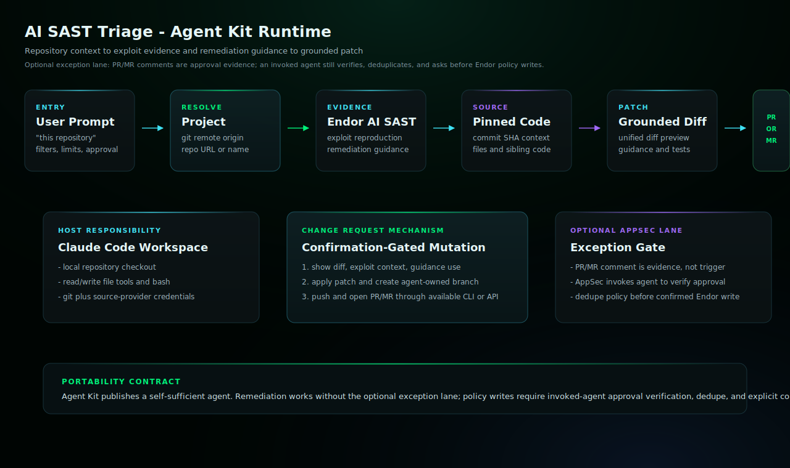

# AI SAST Triage

Parse Endor AI SAST findings, use exploit reproduction and remediation guidance as patch context, fetch source at the pinned commit, and open change requests when requested.

## Install

Copy `ai-sast-triage.md` into your target repository's `.claude/agents/` directory,
then restart Claude Code if needed.

## Requirements

- Claude Code with the generated subagent file installed.
- Endor tenant access through authenticated `endorctl api` or documented Endor API credentials.
- A local workspace checkout for any repository the agent will patch.
- Git and source-provider credentials that can push a branch and open the requested pull request or merge request.
- GitHub or GitLab credentials that can read PR/MR reviews and comments from the target repository.
- A configured AppSec approver list when the agent is allowed to create Endor exception policies in standalone mode.
- Endor policy-write access for direct exception-policy creation after verified AppSec approval.

## Setup Checklist

### 1. Install The Subagent

Run this from the target repository where Claude Code will operate:

```bash
mkdir -p .claude/agents
cp /path/to/endor-labs-agent-kit/claude-code/ai-sast-triage/ai-sast-triage.md \
  .claude/agents/ai-sast-triage.md
```

Or ask an LLM with filesystem access to do it:

```text
Install the Endor Labs AI SAST Triage agent in this repository.

Agent Kit root: /path/to/endor-labs-agent-kit
Agent artifact: claude-code/ai-sast-triage/ai-sast-triage.md
Install path: .claude/agents/ai-sast-triage.md

Preserve the generated agent prompt exactly. After installing it, check
endorctl, git remote, and GitHub/GitLab CLI access, then tell
me the exact prompt to invoke the agent.
```

### 2. Verify Local Access

Run the checks that match your source provider:

```bash
git remote -v
endorctl --version
gh auth status        # GitHub repositories
glab auth status      # GitLab repositories
```

Claude Code does not need an Endor MCP server for this agent. If `endorctl`,
direct Endor API credentials, or source-provider credentials are not
authenticated, the agent should report the missing setup in `data_gaps`.

### 3. Understand Finding Evidence

When Endor AI SAST includes `## Exploit Reproduction`, the agent uses it
for priority, confidence, and safe local validation planning. It must not
run exploit steps against live systems or paste weaponized detail into a
PR/MR body.

When Endor AI SAST includes `## Remediation Guidance`, the agent uses it as
patch context. It can apply the guidance as-is, adapt it to the codebase,
or reject it with a reason when the pinned source or tests show a safer fix.

### 4. Configure AppSec Approvers

Standalone exception creation requires an approval artifact in the PR/MR.
Give the agent the allowed approvers before it creates an Endor exception
policy. Use GitHub handles, GitLab usernames, or team slugs:

```text
AppSec approvers: @alice, @bob, @endor-labs/appsec
```

The developer requesting the exception must not approve their own request.

### 5. Approval Comment Format

When the agent requests an exception, an AppSec approver should comment or
review with one of these exact forms:

```text
APPSEC APPROVED: false positive for finding <finding_uuid> - <why this is not exploitable>
APPSEC APPROVED: accept risk for finding <finding_uuid> until YYYY-MM-DD - <owner, mitigation, and why code will not change now>
```

The agent verifies the approver, finding UUID, request type, and expiration
before it renders the Endor policy spec.

### 6. Policy Creation Gate

The agent may create a scoped Endor exception policy only after all of these
are true:

- AppSec approval evidence is verified from the PR/MR.
- The policy spec is shown in the Claude Code session.
- The user explicitly confirms policy creation.
- Endor returns a policy UUID.

## Example

```text
@agent-ai-sast-triage triage AI SAST findings for this repository. Do not open a PR until I approve the patch.
```

## Example Workflow

Use these copy/paste prompts after the agent is installed. Replace the
placeholders with the finding UUID, PR/MR URL, date, and AppSec approvers
from your environment.

### 1. Triage Without Mutating

```text
@agent-ai-sast-triage triage AI SAST findings for this repository. Do not edit files, open a PR/MR, or create an Endor policy. Show confirmed true positives, likely false positives, inconclusive findings, exploit-driven priority, remediation-guidance usage, and data gaps.
```

### 2. Open One Remediation PR

```text
@agent-ai-sast-triage remediate finding <finding_uuid> for this repository. Use Endor Exploit Reproduction and Remediation Guidance as context, but verify the fix against the source. Show me the patch, branch name, PR/MR title, and PR/MR body before pushing. After I approve, open exactly one PR/MR.
```

### 3. Request Exception Approval

```text
@agent-ai-sast-triage request an AppSec exception review for finding <finding_uuid> on PR/MR <pr_or_mr_url>. Allowed AppSec approvers: @alice, @bob. Do not create an Endor policy yet. Post or update a PR/MR comment with the exact approval phrases the approver can use.
```

### 4. AppSec Approval Comment

An allowed AppSec approver can use one of these comments or review bodies:

```text
APPSEC APPROVED: false positive for finding <finding_uuid> - <why this is not exploitable>
APPSEC APPROVED: accept risk for finding <finding_uuid> until YYYY-MM-DD - <owner, mitigation, and why code will not change now>
```

The requester, PR author, and agent account must not approve their own
exception request.

### 5. Create The Scoped Endor Exception Policy

```text
@agent-ai-sast-triage verify AppSec approval on PR/MR <pr_or_mr_url> for finding <finding_uuid>. Allowed AppSec approvers: @alice, @bob. If approval is valid and not self-approval, render the Endor exception policy spec for my confirmation. After I confirm, create the scoped policy and comment on the PR/MR with the policy UUID, approver, expiration, scope, and evidence URL.
```

Do not combine remediation and exception approval in normal production use.
If you test both paths for QA, label the exception as temporary validation.
Redact concrete exploit payloads from PR/MR prose and comments.

## QA Smoke Test

When validating this agent, isolate the run from user-level Claude skills so
the result proves the Agent Kit artifact itself is doing the work.

```bash
export CLAUDE_CONFIG_DIR="$(mktemp -d)"
claude -p --agent ai-sast-triage --permission-mode bypassPermissions \
  "Triage AI SAST findings for this repository. Do not open a PR until I approve the patch."
```

The run log should not reference user-level skills such as
`~/.claude/skills/endor-ai-sast`. If it does, the test is contaminated
and should be rerun in a clean Claude configuration.

## Architecture



In Agent Kit, PR/MR creation is host-mediated. Claude Code runs in the target checkout, gathers Endor evidence including exploit reproduction and remediation guidance when present, applies the confirmed diff locally, creates and pushes a branch, then opens the change request with configured source-provider credentials. If the host cannot perform one of those steps, the agent must stop and report the missing capability in `data_gaps`.

## Notes

- This agent preserves the AI SAST triage workflow capabilities as a mutating agent.
- The agent may fetch source context, prepare patches, edit files, run commands, open a change request, verify AppSec approval evidence, and create an Endor exception policy when the workflow requires it.
- Confirm repository and branch targets before allowing write or pull-request actions. Confirm the rendered Endor policy spec before allowing exception-policy creation.
- `actions.yaml` lists the semantic side effects and any external adapter requirements.
