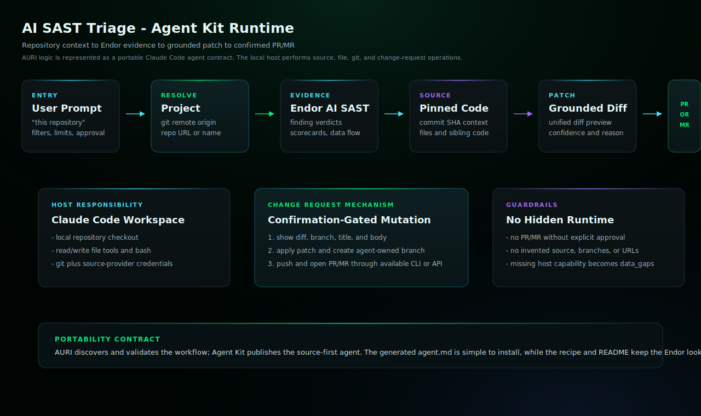

# AI SAST Triage Enterprise Edition

Parse Endor AI SAST findings, fetch source at the pinned commit, generate grounded patches for confirmed true positives, and open change requests when requested.

## Install

Copy `ai-sast-triage.md` into your target repository's `.claude/agents/` directory,
then restart Claude Code if needed.

## Requirements

- Claude Code with the generated subagent file installed.
- Endor tenant access through the configured Endor MCP server and documented Endor API lookups.
- A local workspace checkout for any repository the agent will patch.
- Git and source-provider credentials that can push a branch and open the requested pull request or merge request.

## Example

```text
@agent-ai-sast-triage triage AI SAST findings for this repository. Do not open a PR until I approve the patch.
```

## Architecture



In Agent Kit, PR/MR creation is host-mediated. Claude Code runs in the target checkout, gathers Endor evidence, applies the confirmed diff locally, creates and pushes a branch, then opens the change request with configured source-provider credentials. If the host cannot perform one of those steps, the agent must stop and report the missing capability in `data_gaps`.

## Notes

- This edition preserves the AURI workflow capabilities as a mutating agent.
- The agent may fetch source context, prepare patches, edit files, run commands, and open a change request when the workflow requires it.
- Confirm repository and branch targets before allowing write or pull-request actions.
