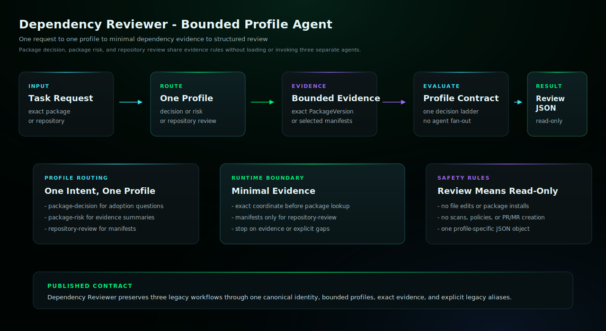

# Dependency Reviewer Enterprise Edition

Use this agent when the user wants an exact package decision, a package risk
summary, or a repository dependency review. It selects one bounded task
profile, gathers only the evidence that profile needs, and returns a
read-only decision or review with explicit data gaps.

## Start Here

This is the Claude Code generated edition for `dependency-reviewer`.

| Reader | First move |
| --- | --- |
| Human operator | Copy the generated subagent into `.claude/agents/` and restart Claude Code if needed. Then use the example prompt below: @agent-dependency-reviewer review this repository's exact direct dependencies with bounded read-only evidence |
| Agent installer | Copy the generated files exactly, including the generated prompt or skill file, `endorctl-setup.md`, `architecture.svg`. Do not summarize or rewrite the generated prompt. |
| Maintainer | Change `source/agents/dependency-reviewer/recipe.yaml`, `instructions.md`, evals, action contracts, or `architecture.svg`, then regenerate the catalog. Do not hand-edit generated copies. |

## Recommended Model

This is a release-QA target, not a requirement or model allowlist.
Agent Kit does not block compatible customer-selected host models.

- Recommended model: `sonnet`.
- Selection mode: `pinned`.
- Recommended reasoning/effort: `host default`.
- Generated behavior: agent frontmatter defaults to sonnet.
- Override behavior: Claude environment or per-invocation subagent override wins.
- Provider guidance: <https://code.claude.com/docs/en/sub-agents>.

## Install

Copy `dependency-reviewer.md` into your target repository's `.claude/agents/` directory,
then restart Claude Code if needed.

## Requirements

- Claude Code with the generated subagent file installed.
- Endor MCP access through the subagent's bundled MCP server config.
- Authenticated endorctl for the read-only API lookups documented in endorctl-setup.md.

## Example

```text
@agent-dependency-reviewer review this repository's exact direct dependencies with bounded read-only evidence
```

## Architecture



This diagram shows the generated agent contract, host responsibilities, and external systems required at runtime.

## Notes

- This edition uses MCP first, then read-only `endorctl agent api --agent-id dependency-reviewer` lookups for richer signals.
- Bash use is limited by prompt to the documented Endor lookup commands.
