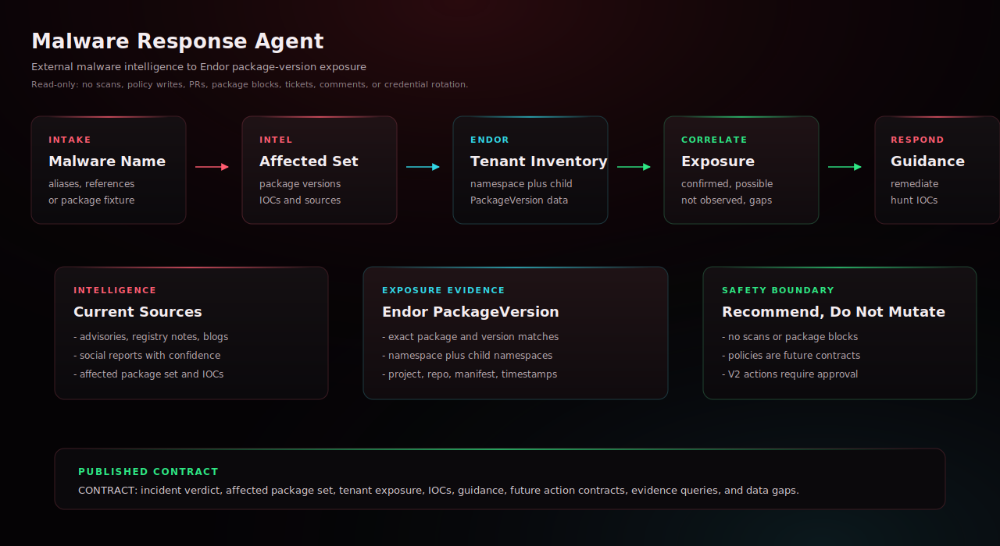

# Malware Response Agent

Use this agent when a customer needs rapid read-only response to a software
supply-chain malware incident. It gathers or ingests current malware
intelligence, normalizes affected package and version evidence, and
correlates that evidence against Endor Labs tenant package inventory across a
namespace and child namespaces. It reports confirmed exposure, possible
exposure, unaffected scope, indicators of compromise, remediation guidance,
and future action contracts without mutating Endor Labs or source systems.

## Start Here

This is the Claude Code generated agent for `malware-response`.

| Reader | First move |
| --- | --- |
| Human operator | Copy the generated subagent into `.claude/agents/` and restart Claude Code if needed. Then use the example prompt below: @agent-malware-response help |
| Agent installer | Copy the generated files exactly, including the generated prompt or skill file, `endorctl-setup.md`, `architecture.svg`. Do not summarize or rewrite the generated prompt. |
| Maintainer | Change `source/agents/malware-response/recipe.yaml`, `instructions.md`, evals, action contracts, or `architecture.svg`, then regenerate the catalog. Do not hand-edit generated copies. |

## Install

Copy `malware-response.md` into your target repository's `.claude/agents/` directory,
then restart Claude Code if needed.

## Requirements

- Claude Code with the generated subagent file installed.
- Authenticated endorctl for the read-only API lookups documented in endorctl-setup.md.

## Example

```text
@agent-malware-response help
```

## Architecture



This diagram shows the generated agent contract, host responsibilities, and external systems required at runtime.

## Notes

- This agent uses read-only endorctl api lookups and does not require Endor MCP.
- Bash use is limited by prompt to the documented Endor lookup commands.
