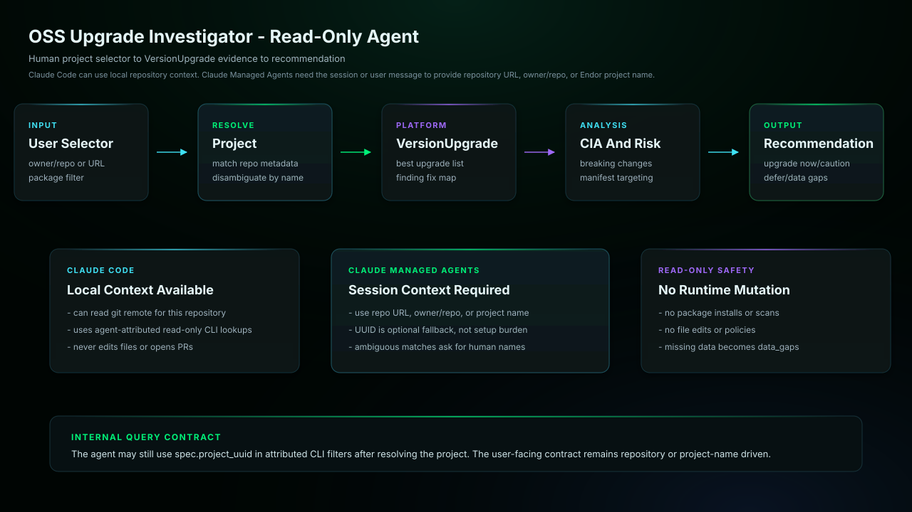

# OSS Upgrade Investigator

Evaluates candidate dependency upgrades using Endor VersionUpgrade data,
Code Impact Analysis, findings, breaking-change information, and
Endor-provided manifest targets. It compares findings fixed or introduced
and explains the safest available upgrade path, including whether to upgrade
now, proceed cautiously, defer, or gather more evidence.

## Start Here

This is the Claude Code generated agent for `oss-upgrade-investigator`.

| Reader | First move |
| --- | --- |
| Human operator | Copy the generated subagent into `.claude/agents/` and restart Claude Code if needed. Then use the example prompt below: @agent-oss-upgrade-investigator show the safest upgrade path for repository <owner>/<repo> package lodash, including CIA and manifest files |
| Agent installer | Copy the generated files exactly, including the generated prompt or skill file, `endorctl-setup.md`, `architecture.svg`. Do not summarize or rewrite the generated prompt. |
| Maintainer | Change `source/agents/oss-upgrade-investigator/recipe.yaml`, `instructions.md`, evals, action contracts, or `architecture.svg`, then regenerate the catalog. Do not hand-edit generated copies. |

## Recommended Model

This is a release-QA target, not a requirement or model allowlist.
Agent Kit does not block compatible customer-selected host models.

- Recommended model: `sonnet`.
- Selection mode: `pinned`.
- Recommended reasoning/effort: `host default`.
- Generated behavior: agent frontmatter defaults to sonnet.
- Override behavior: Claude environment or per-invocation subagent override wins.
- Provider guidance: <https://code.claude.com/docs/en/sub-agents>.

## Install

Copy `oss-upgrade-investigator.md` into your target repository's `.claude/agents/` directory,
then restart Claude Code if needed.

## Requirements

- Claude Code with the generated subagent file installed.
- Authenticated endorctl for the read-only API lookups documented in endorctl-setup.md.

## Example

```text
@agent-oss-upgrade-investigator show the safest upgrade path for repository <owner>/<repo> package lodash, including CIA and manifest files
```

## Architecture



This read-only agent resolves a human project selector to the Endor project used for VersionUpgrade queries. Claude Managed Agents do not inspect local git by default, so sessions should provide a repository URL, owner/repo, or Endor project name instead of requiring a project UUID.

## Notes

- This agent uses read-only `endorctl agent api --agent-id oss-upgrade-investigator` lookups and does not require Endor MCP.
- Bash use is limited by prompt to the documented Endor lookup commands.
