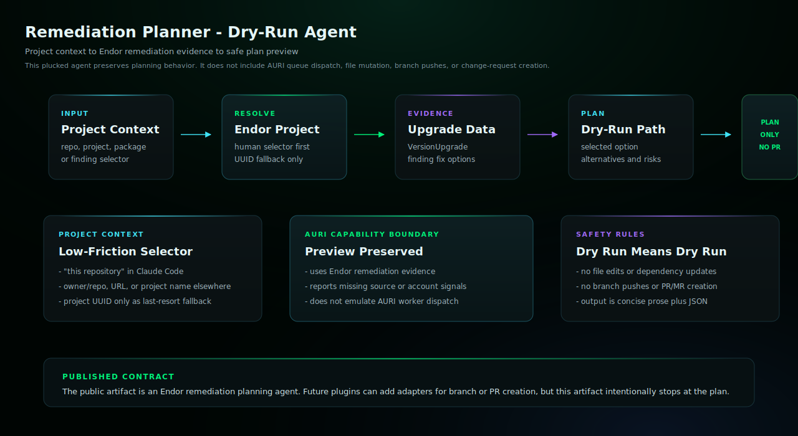

# Remediation Planner Enterprise Edition

Preview safe remediation options without opening PRs.

## Install

Copy `remediation-planner.md` into your target repository's `.claude/agents/` directory,
then restart Claude Code if needed.

## Requirements

- Claude Code with the generated subagent file installed.
- Endor MCP access through the subagent's bundled MCP server config.
- No shell access or authenticated endorctl setup is required for this edition.

## Example

```text
@agent-remediation-planner preview remediation options for this repository
```

## Architecture



This dry-run workflow resolves project or finding context, gathers Endor remediation evidence, and returns a plan only. It does not edit files, push branches, or open PRs/MRs.

## Notes

- This edition uses Endor MCP tools only.
- It records unavailable non-MCP signals in data_gaps rather than fabricating evidence.
