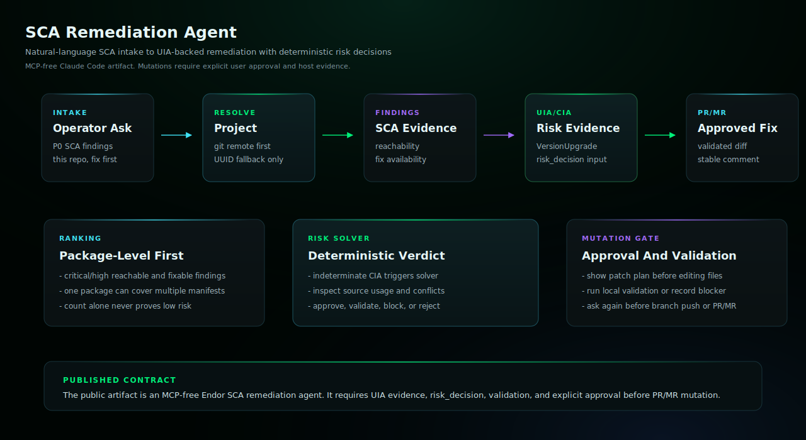

# SCA Remediation Agent

Remediate reachable and exploitable dependency vulnerabilities with Endor SCA findings, VersionUpgrade/UIA evidence, local validation, and approved PR/MR creation.

## Install

Copy `sca-remediation-agent.md` into your target repository's `.claude/agents/` directory,
then restart Claude Code if needed.

## Requirements

- Claude Code with the generated subagent file installed.
- Endor tenant access through authenticated `endorctl api` or documented Endor API credentials.
- A local workspace checkout for any repository the agent will patch.
- Git and source-provider credentials that can push a branch and open the requested pull request or merge request.

## Setup Checklist

### 1. Install The Subagent

Run this from the target repository where Claude Code will operate:

```bash
mkdir -p .claude/agents
cp /path/to/endor-labs-agent-kit/claude-code/sca-remediation-agent/sca-remediation-agent.md \
  .claude/agents/sca-remediation-agent.md
```

### 2. Verify Local Access

Run the checks that match your source provider:

```bash
git remote -v
endorctl --version
endorctl host-check
gh auth status        # GitHub repositories
glab auth status      # GitLab repositories
```

Claude Code does not need an Endor MCP server for this agent. If `endorctl`,
direct Endor API credentials, local dependency-manager tooling, or
source-provider credentials are not authenticated, the agent should report
the missing setup in `data_gaps`.

### 3. Prepare For Approval Gates

The agent shows UIA evidence, risk_decision, target files, diff,
validation plan, branch, and PR/MR body before mutating. Approve file
edits and PR/MR creation as separate steps.

## Example

```text
@agent-sca-remediation-agent check this repository for P0 SCA findings I can start remediating. Do not edit files or open a PR until I approve.
```

## Example Workflow

Use these copy/paste prompts after the agent is installed.

### 1. Rank Without Mutating

```text
@agent-sca-remediation-agent check this repository for P0 SCA findings I can start remediating. Do not edit files or open a PR/MR. Rank package-level fixes and show the UIA evidence for the best first fix.
```

### 2. Prepare One Patch

```text
@agent-sca-remediation-agent prepare the top UIA-backed dependency remediation for this repository. Show the selected package, affected manifests, VersionUpgrade/UIA UUID, risk, CIA status, risk_decision, findings fixed, folded advisory/finding list, validation command, branch name, PR/MR title, and body before changing files.
```

### 3. Open The PR/MR After Approval

```text
@agent-sca-remediation-agent apply the approved patch, run local validation, and then ask me before pushing a branch or opening the PR/MR. Use the AURI-style PR/MR body with emoji sections, UIA evidence, validation status, and a folded advisory/finding list.
```

Do not call a high-count finding bucket low risk unless the response shows
the actual VersionUpgrade/UIA evidence. Prefer a package-level fix when one
package upgrade clears findings across multiple manifests. Future PR/MR bodies
should include the folded `Advisories This Upgrade Fixes` section, and should
scope compatibility claims to Endor UIA/CIA plus validation that actually ran.
If CIA is indeterminate or risk is medium/high, the agent should produce a
deterministic `risk_decision` from Endor evidence plus local source usage
instead of recommending a manual release-note skim.
The selection/plan gate is not complete until that `risk_decision` is
present; low UIA risk, zero conflicts, and a simple manifest edit are
inputs to the verdict, not replacements for it.
Use the branch convention `remediation/sca/<package>-<target-version>`
unless the user explicitly asks for a different branch name.

## QA Smoke Test

When validating this agent, isolate the run from user-level Claude skills so
the result proves the Agent Kit artifact itself is doing the work.

```bash
export CLAUDE_CONFIG_DIR="$(mktemp -d)"
claude -p --agent sca-remediation-agent --permission-mode bypassPermissions \
  "Check this repository for P0 SCA findings I can start remediating. Do not edit files or open a PR until I approve."
```

The run log should not reference user-level skills or Endor MCP tooling.
If it does, the test is contaminated and should be rerun in a clean
Claude configuration.

## Architecture



This mutating Claude Code agent resolves repository context, queries Endor SCA findings, requires VersionUpgrade/UIA evidence before recommending a best first fix, resolves risky or CIA-indeterminate upgrades into a deterministic risk_decision, prepares local dependency changes, runs validation when possible, and opens a PR/MR only after explicit approval. It does not use or require an Endor MCP server.

## Notes

- This agent preserves the SCA remediation workflow capabilities as a mutating agent.
- The agent may query Endor SCA findings and VersionUpgrade/UIA evidence, inspect local manifests, produce a deterministic risk_decision, prepare dependency changes, run validation, open a change request, and post a remediation comment when approved.
- Confirm the selected package, UIA evidence, risk_decision, target files, generated diff, validation status, branch, and PR/MR body before allowing mutations.
- `actions.yaml` lists the semantic side effects and any external adapter requirements.
