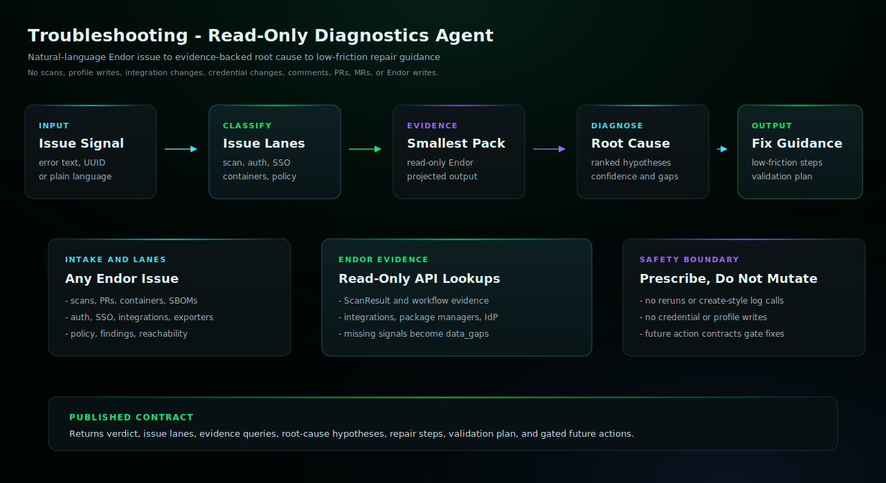

# Troubleshooting

Use this agent when the user needs help diagnosing and fixing Endor Labs
errors, warnings, missing integrations, scan failures, slow scans, or
unhealthy configuration. Troubleshooting gathers the smallest useful
read-only Endor evidence, classifies the issue across scan, integration,
authentication, dependency resolution, container, reachability, policy, and
workflow lanes, then returns low-friction repair guidance without mutating
Endor, source-provider, or repository state.

## Start Here

This is the Claude Code generated agent for `troubleshooting`.

| Reader | First move |
| --- | --- |
| Human operator | Copy the generated subagent into `.claude/agents/` and restart Claude Code if needed. Then use the example prompt below: @agent-troubleshooting diagnose this Endor scan failure from redacted error text and read-only tenant evidence |
| Agent installer | Copy the generated files exactly, including the generated prompt or skill file, `endorctl-setup.md`, `architecture.svg`. Do not summarize or rewrite the generated prompt. |
| Maintainer | Change `source/agents/troubleshooting/recipe.yaml`, `instructions.md`, evals, action contracts, or `architecture.svg`, then regenerate the catalog. Do not hand-edit generated copies. |

## Install

Copy `troubleshooting.md` into your target repository's `.claude/agents/` directory,
then restart Claude Code if needed.

## Requirements

- Claude Code with the generated subagent file installed.
- Authenticated endorctl for the read-only API lookups documented in endorctl-setup.md.

## Setup Checklist

### 1. Install The Subagent

Run this from the workspace where Claude Code will perform the
read-only Endor troubleshooting:

```bash
mkdir -p .claude/agents
cp /path/to/endor-labs-agent-kit/claude-code/troubleshooting/troubleshooting.md \
  .claude/agents/troubleshooting.md
```

### 2. Verify Read-Only Endor Access

```bash
endorctl --version
```

Troubleshooting does not need an Endor MCP server. It uses only
documented read-only `endorctl agent api --agent-id troubleshooting` lookups and user-provided redacted
error text. If Endor access, project selectors, scan evidence, workflow
evidence, or integration evidence are unavailable, the agent should report
the missing setup in `data_gaps`.

### 3. Keep Troubleshooting Read-Only

The agent may inspect scan, workflow, integration, package manager, SSO,
policy, finding, reachability, and container evidence through read-only
Endor lookups. It should not run scans, create scan log requests, change
credentials, edit scan profiles, update integrations, post comments, open
PRs/MRs, or mutate Endor state.

## Example

```text
@agent-troubleshooting diagnose this Endor scan failure from redacted error text and read-only tenant evidence
```

## Example Workflow

Use these copy/paste prompts after the agent is installed.

```text
@agent-troubleshooting diagnose this Endor scan failure. Namespace: <namespace>. Project: <project>. Error: <redacted error text>. Keep the workflow read-only and tell me the lowest-friction fix.
```

```text
@agent-troubleshooting our PR scans take too long in a large monorepo. Check whether incremental PR scans, baselines, scan profile settings, or workflow configuration would improve performance. Do not change the profile or rerun scans.
```

```text
@agent-troubleshooting users cannot log in through SSO for namespace <namespace>. Inspect read-only identity provider evidence and tell me what to verify without printing secrets.
```

The result should explain the likely cause, cite the evidence gathered,
rank repair steps by friction, and place any scan rerun, profile edit,
integration update, credential change, comment, or support-ticket step
in `future_action_contracts`.

## QA Smoke Test

When validating this agent, isolate the run from user-level Claude skills so
the result proves the Agent Kit artifact itself is doing the work.

```bash
export CLAUDE_CONFIG_DIR="$(mktemp -d)"
claude -p --agent troubleshooting \
  "Diagnose this Endor issue from redacted text only: endorctl scan exited with code 13 because dependencies were not downloaded. Keep it read-only."
```

The run log should not reference user-level skills or Endor MCP tooling,
and it should not claim scan reruns, configuration changes, comments,
branches, PRs/MRs, or Endor writes.

## Architecture



This read-only agent diagnoses Endor Labs errors, warnings, scan failures, slow scans, missing integrations, and unhealthy configuration from user-provided issue text plus read-only Endor evidence. It returns a troubleshooting verdict, issue lanes, evidence queries, root-cause hypotheses, low-friction repair guidance, validation steps, and gated future action contracts for anything that would mutate Endor, source-provider, registry, CI, or repository state.

## Notes

- This agent diagnoses Endor Labs errors, warnings, missing integrations, scan failures, slow scans, and unhealthy configuration from user-provided issue text plus read-only Endor evidence.
- It returns a troubleshooting verdict, issue lanes, evidence queries, root-cause hypotheses, low-friction repair guidance, validation steps, and gated future action contracts.
- It must not run scans, create scan log requests, change credentials, edit scan profiles, update integrations, post comments, open PRs/MRs, or mutate Endor state.
