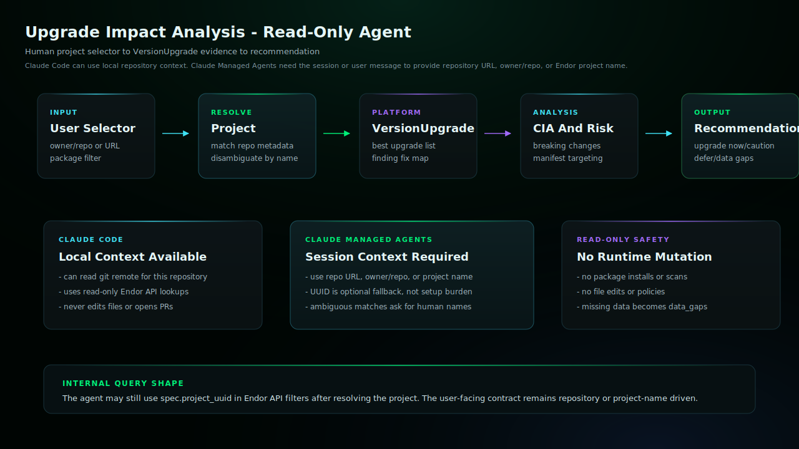

# Endor Labs Upgrade Impact Analysis

Use this agent when the user asks for Endor Labs Upgrade Impact Analysis:
safe upgrade paths, upgrade risk, findings fixed or introduced, Code Impact
Analysis, breaking changes, manifest targeting, or whether a dependency
upgrade should happen now. The artifact queries Endor's read-only
VersionUpgrade workflow through documented Endor API or endorctl paths.

## Install

Copy `upgrade-impact-analysis.md` into your target repository's `.claude/agents/` directory,
then restart Claude Code if needed.

## Requirements

- Claude Code with the generated subagent file installed.
- Authenticated endorctl for the read-only API lookups documented in endorctl-setup.md.

## Example

```text
@agent-upgrade-impact-analysis show the safest upgrade path for repository <owner>/<repo> package lodash, including CIA and manifest files
```

## Architecture



This read-only agent resolves a human project selector to the Endor project used for VersionUpgrade queries. Claude Managed Agents do not inspect local git by default, so sessions should provide a repository URL, owner/repo, or Endor project name instead of requiring a project UUID.

## Notes

- This agent uses read-only endorctl api lookups and does not require Endor MCP.
- Bash use is limited by prompt to the documented Endor lookup commands.
