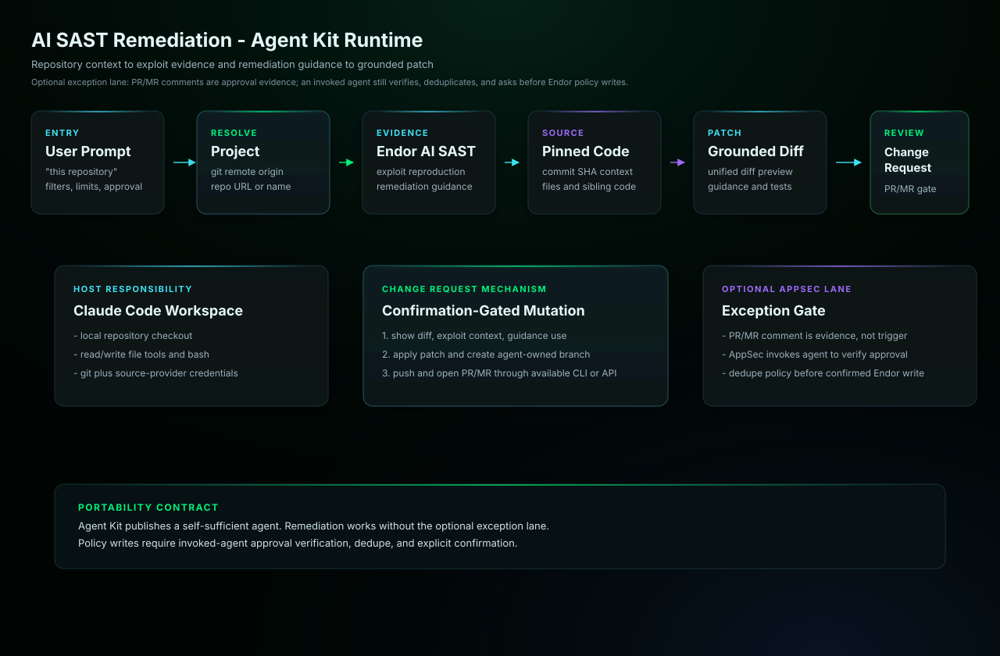

# AI SAST Remediation

Triages Endor AI SAST findings using exploit-reproduction evidence,
data-flow context, and remediation guidance to distinguish actionable
vulnerabilities from noise. It can prepare targeted code fixes and, after
explicit approval, edit files and open change requests. For exception
workflows, it can create or update scoped Endor exception policies only
after verified AppSec approval and explicit user confirmation.

## Start Here

This is the Claude Managed Agents generated agent for `ai-sast-remediation`.

| Reader | First move |
| --- | --- |
| Human operator | Update generated YAML placeholders, then create the managed agent and environment. Then use the example prompt below: Triage AI SAST findings for this repository. Do not open a PR until I approve the patch. |
| Agent installer | Copy the generated files exactly, including the generated prompt or skill file, `actions.yaml`, `endorctl-setup.md`, `architecture.svg`. Do not summarize or rewrite the generated prompt. |
| Maintainer | Change `source/agents/ai-sast-remediation/recipe.yaml`, `instructions.md`, evals, action contracts, or `architecture.svg`, then regenerate the catalog. Do not hand-edit generated copies. |

## Recommended Model

This is a release-QA target, not a requirement or model allowlist.
Agent Kit does not block compatible customer-selected host models.

- Recommended model: `sonnet`.
- Selection mode: `pinned`.
- Recommended reasoning/effort: `host default`.
- Generated behavior: recipe sonnet alias compiles to claude-sonnet-4-6.
- Override behavior: managed host configuration remains authoritative.
- Provider guidance: <https://code.claude.com/docs/en/sub-agents>.

## Install

Update placeholders in `agent.yaml`, `environment.yaml`, and
`session-template.yaml`, then create the agent and environment in
Claude Managed Agents.

```bash
ant beta:agents create < agent.yaml
ant beta:environments create < environment.yaml
```

Use `session-template.yaml` as the starting point for session creation after
you have the created agent ID, environment ID, and any required vault IDs.

## Requirements

- Anthropic Console or `ant` CLI access to Claude Managed Agents.
- An environment that can install and authenticate endorctl for the Endor API calls documented in endorctl-setup.md.
- A GitHub repository mounted through session `resources` with an authorization token allowed to push branches and open change requests.
- An Anthropic credential vault supplying `ENDOR_API_CREDENTIALS_KEY` and `ENDOR_API_CREDENTIALS_SECRET` as environment-variable credentials scoped to api.endorlabs.com.
- A `static_bearer` vault credential for the generated `github` MCP server URL, holding a fine-grained GitHub token with Contents and Pull requests write access. The remote GitHub MCP server is available on every GitHub plan and needs no Copilot license.

## Example User Message

```text
Triage AI SAST findings for this repository. Do not open a PR until I approve the patch.
```

## Architecture



In Agent Kit, PR/MR creation is host-mediated. Claude Code runs in the target checkout, gathers Endor evidence including exploit reproduction and remediation guidance when present, applies the confirmed diff locally, creates and pushes a branch, then opens the change request with configured source-provider credentials. If the host cannot perform one of those steps, the agent must stop and report the missing capability in `data_gaps`.

## Notes

- This agent triages Endor AI SAST findings with exploit-reproduction evidence and prepares targeted fixes; file edits and change requests run only after explicit approval.
- Endor exception policies are created or updated only after verified AppSec approval plus explicit user confirmation; `create_scoped_exception_policy` is the only mutating Endor API call.
- Every mutating action is approval-gated: pre-built tools use always_ask permissions and the workflow requires explicit in-session approval before any change.
- The generated environment allows api.endorlabs.com plus GitHub.com/API hosts so an approved remediation can push a branch and open a change request on the mounted repository.
- The generated `agent.yaml` enables Bash plus the read, write, edit, glob, and grep tools from the pre-built toolset, each with confirmation required.
- No source-provider CLI exists in the managed sandbox, so source-provider reads and change-request creation run through the generated `github` MCP toolset. Copilot-backed MCP tools are out of scope for this agent and are never called.
