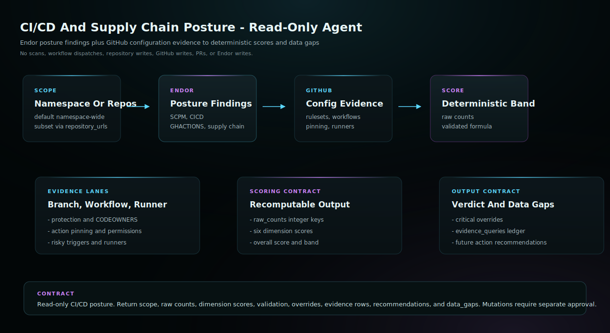

# CI/CD And Supply Chain Posture

Use this agent when the user wants a read-only CI/CD and supply chain
posture assessment for an Endor namespace, GitHub organization, repository
set, or current repository. The agent combines existing Endor SCPM, CI/CD,
GitHub Actions, and supply-chain findings with read-only GitHub configuration
evidence and optional local CI file inspection, then returns deterministic
scores, critical overrides, evidence queries, and data gaps without mutating
Endor, GitHub, or repository state.

## Start Here

This is the Claude Managed Agents generated agent for `cicd-posture`.

| Reader | First move |
| --- | --- |
| Human operator | Update generated YAML placeholders, then create the managed agent and environment. Then use the example prompt below: Assess CI/CD and supply chain posture for namespace <namespace>. Keep the workflow read-only. |
| Agent installer | Copy the generated files exactly, including the generated prompt or skill file, `endorctl-setup.md`, `architecture.svg`. Do not summarize or rewrite the generated prompt. |
| Maintainer | Change `source/agents/cicd-posture/recipe.yaml`, `instructions.md`, evals, action contracts, or `architecture.svg`, then regenerate the catalog. Do not hand-edit generated copies. |

## Recommended Model

This is a release-QA target, not a requirement or model allowlist.
Agent Kit does not block compatible customer-selected host models.

- Recommended model: `sonnet`.
- Selection mode: `pinned`.
- Recommended reasoning/effort: `host default`.
- Generated behavior: recipe sonnet alias compiles to claude-sonnet-4-6.
- Override behavior: managed host configuration remains authoritative.
- Provider guidance: <https://code.claude.com/docs/en/sub-agents>.

## Install

Update placeholders in `agent.yaml`, `environment.yaml`, and
`session-template.yaml`, then create the agent and environment in
Claude Managed Agents.

```bash
ant beta:agents create < agent.yaml
ant beta:environments create < environment.yaml
```

Use `session-template.yaml` as the starting point for session creation after
you have the created agent ID, environment ID, and any required vault IDs.

## Requirements

- Anthropic Console or `ant` CLI access to Claude Managed Agents.
- An environment that can install and authenticate endorctl for the read-only API lookups documented in endorctl-setup.md.
- Read-only GitHub.com credentials available to the managed session, or exported GitHub inventory JSON supplied in the prompt.

## Example User Message

```text
Assess CI/CD and supply chain posture for namespace <namespace>. Keep the workflow read-only.
```

## Architecture



This read-only agent assesses CI/CD and supply chain posture from existing Endor SCPM, CI/CD, GitHub Actions, and supply-chain findings plus read-only GitHub configuration evidence. It returns deterministic dimension scores, critical overrides, evidence queries, recommended human actions, and data gaps without running scans, changing branch protection, editing workflows, dispatching workflows, or mutating Endor state.

## Notes

- This agent assesses CI/CD and supply chain posture from existing Endor findings plus read-only GitHub repository configuration evidence.
- It uses read-only Endor and GitHub lookups to produce dimension scores, critical overrides, evidence queries, recommended actions, and data gaps.
- The generated environment allows api.endorlabs.com plus GitHub.com/API hosts for read-only evidence. It still must not run scans, clone repositories, dispatch workflows, change branch protection or repository settings, open PRs/MRs, or mutate Endor state.
