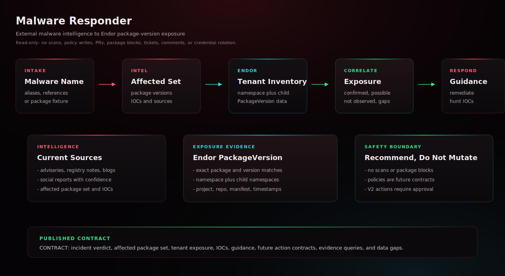

# Malware Responder

Use this agent when a customer needs rapid read-only response to a software
supply-chain malware incident. It gathers or ingests current malware
intelligence, normalizes affected package and version evidence, and
correlates that evidence against Endor Labs tenant package inventory across a
namespace and child namespaces. It reports confirmed exposure, possible
exposure, unaffected scope, indicators of compromise, remediation guidance,
and future action contracts without mutating Endor Labs or source systems.

## Start Here

This is the Claude Managed Agents generated agent for `malware-responder`.

| Reader | First move |
| --- | --- |
| Human operator | Update generated YAML placeholders, then create the managed agent and environment. Then use the example prompt below: Help me use this Endor Labs agent. |
| Agent installer | Copy the generated files exactly, including the generated prompt or skill file, `endorctl-setup.md`, `architecture.svg`. Do not summarize or rewrite the generated prompt. |
| Maintainer | Change `source/agents/malware-responder/recipe.yaml`, `instructions.md`, evals, action contracts, or `architecture.svg`, then regenerate the catalog. Do not hand-edit generated copies. |

## Recommended Model

This is a release-QA target, not a requirement or model allowlist.
Agent Kit does not block compatible customer-selected host models.

- Recommended model: `sonnet`.
- Selection mode: `pinned`.
- Recommended reasoning/effort: `host default`.
- Generated behavior: recipe sonnet alias compiles to claude-sonnet-4-6.
- Override behavior: managed host configuration remains authoritative.
- Provider guidance: <https://code.claude.com/docs/en/sub-agents>.

## Install

Update placeholders in `agent.yaml`, `environment.yaml`, and
`session-template.yaml`, then create the agent and environment in
Claude Managed Agents.

```bash
ant beta:agents create < agent.yaml
ant beta:environments create < environment.yaml
```

Use `session-template.yaml` as the starting point for session creation after
you have the created agent ID, environment ID, and any required vault IDs.

## Requirements

- Anthropic Console or `ant` CLI access to Claude Managed Agents.
- An environment that can install and authenticate endorctl for the read-only API lookups documented in endorctl-setup.md.

## Example User Message

```text
Help me use this Endor Labs agent.
```

## Architecture



This diagram shows the generated agent contract, host responsibilities, and external systems required at runtime.

## Notes

- This agent uses read-only `endorctl agent api --agent-id malware-responder` lookups and does not require Endor MCP.
- The generated `agent.yaml` enables only the Managed Agents Bash tool from the pre-built toolset, with confirmation required.
- Bash use remains limited by prompt to the documented Endor lookup commands.
