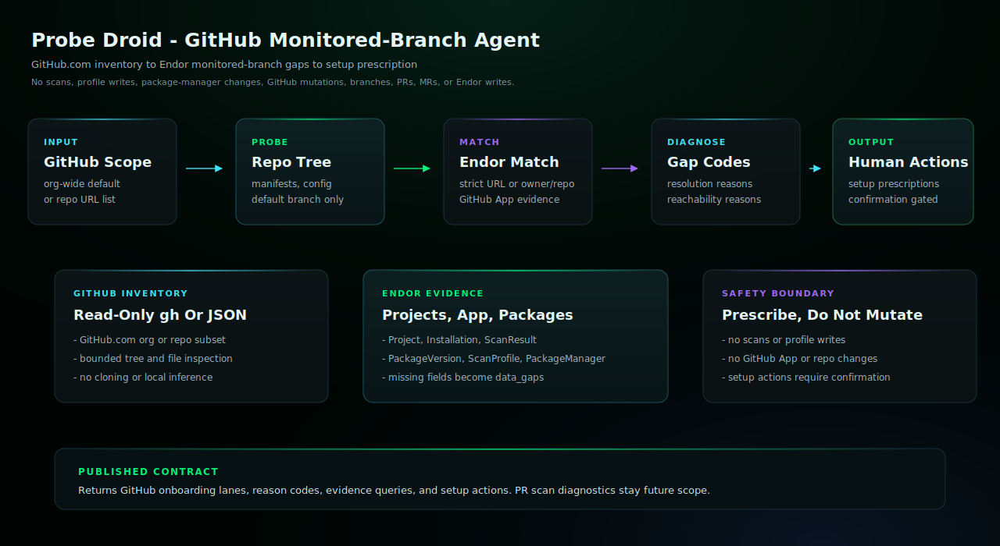

# Probe Droid

Use this agent when the user wants to assess GitHub repository onboarding
gaps for Endor Labs monitored-branch coverage. Probe Droid compares
github.com organization or repository inventory with Endor project, GitHub
App, package, scan, scan profile, package manager integration, dependency
resolution, and reachability evidence, then returns human-readable setup
actions without mutating source, GitHub, or Endor state.

## Install

Update placeholders in `agent.yaml`, `environment.yaml`, and
`session-template.yaml`, then create the agent and environment in
Claude Managed Agents.

```bash
ant beta:agents create < agent.yaml
ant beta:environments create < environment.yaml
```

Use `session-template.yaml` as the starting point for session creation after
you have the created agent ID, environment ID, and any required vault IDs.

## Requirements

- Anthropic Console or `ant` CLI access to Claude Managed Agents.
- An environment that can install and authenticate endorctl for the read-only API lookups documented in endorctl-setup.md.
- Read-only GitHub.com credentials available to the managed session, or exported GitHub inventory JSON supplied in the prompt.

## Example User Message

```text
Probe GitHub org <org> for Endor monitored-branch onboarding gaps and setup prescriptions. Keep the workflow read-only.
```

## Architecture



This read-only agent compares GitHub.com repository inventory with Endor project, GitHub App, monitored-branch scan, package, scan profile, toolchain, and package-manager evidence. It returns onboarding lanes, reason codes, evidence queries, and setup prescriptions, but does not run scans, create profiles, edit repositories, change GitHub settings, or mutate Endor state.

## Notes

- This agent compares GitHub.com repository inventory with Endor project, GitHub App, package, monitored-branch scan, scan profile, toolchain, and package-manager evidence.
- It uses read-only Endor and GitHub lookups to produce onboarding lanes, reason codes, evidence queries, and setup prescriptions.
- The generated environment allows api.endorlabs.com plus GitHub.com/API hosts for read-only inventory. It still must not run scans, clone repositories, create profiles, update package manager integrations, change GitHub settings, open PRs/MRs, or mutate Endor state.
