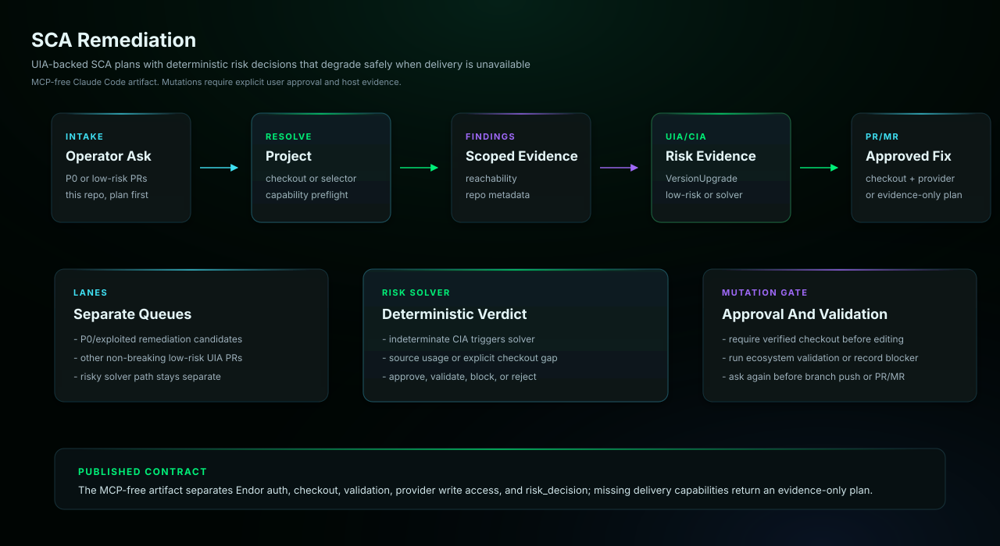

# SCA Remediation

Plans and applies dependency-vulnerability fixes using Endor SCA findings,
VersionUpgrade and Upgrade Impact Analysis evidence, deterministic risk
decisions, and local validation. It separates low-risk changes from upgrades
requiring deeper compatibility review and requires explicit approval before
editing files, pushing branches, opening change requests, or creating
tickets.

## Start Here

This is the Claude Managed Agents generated agent for `sca-remediation`.

| Reader | First move |
| --- | --- |
| Human operator | Update generated YAML placeholders, then create the managed agent and environment. Then use the example prompt below: Check this repository for P0 SCA findings and plan the remediation. Do not edit files or open a change request until I approve. |
| Agent installer | Copy the generated files exactly, including the generated prompt or skill file, `actions.yaml`, `endorctl-setup.md`, `architecture.svg`. Do not summarize or rewrite the generated prompt. |
| Maintainer | Change `source/agents/sca-remediation/recipe.yaml`, `instructions.md`, evals, action contracts, or `architecture.svg`, then regenerate the catalog. Do not hand-edit generated copies. |

## Recommended Model

This is a release-QA target, not a requirement or model allowlist.
Agent Kit does not block compatible customer-selected host models.

- Recommended model: `sonnet`.
- Selection mode: `pinned`.
- Recommended reasoning/effort: `host default`.
- Generated behavior: recipe sonnet alias compiles to claude-sonnet-4-6.
- Override behavior: managed host configuration remains authoritative.
- Provider guidance: <https://code.claude.com/docs/en/sub-agents>.

## Install

Update placeholders in `agent.yaml`, `environment.yaml`, and
`session-template.yaml`, then create the agent and environment in
Claude Managed Agents.

```bash
ant beta:agents create < agent.yaml
ant beta:environments create < environment.yaml
```

Use `session-template.yaml` as the starting point for session creation after
you have the created agent ID, environment ID, and any required vault IDs.

## Requirements

- Anthropic Console or `ant` CLI access to Claude Managed Agents.
- An environment that can install and authenticate endorctl for the Endor API calls documented in endorctl-setup.md.
- A GitHub repository mounted through session `resources` with an authorization token allowed to push branches and open change requests.
- An Anthropic credential vault supplying `ENDOR_API_CREDENTIALS_KEY` and `ENDOR_API_CREDENTIALS_SECRET` as environment-variable credentials scoped to api.endorlabs.com.
- A `static_bearer` vault credential for the generated `github` MCP server URL, holding a fine-grained GitHub token with Contents and Pull requests write access. The remote GitHub MCP server is available on every GitHub plan and needs no Copilot license.

## Example User Message

```text
Check this repository for P0 SCA findings and plan the remediation. Do not edit files or open a change request until I approve.
```

## Architecture



This SCA remediation agent resolves repository context from a matching local checkout or a user-supplied repository selector, queries Endor SCA findings, requires VersionUpgrade/UIA evidence before recommending a best first fix, keeps non-breaking low-risk UIA PR candidates separate from the P0/exploited queue and risky solver, resolves risky or CIA-indeterminate upgrades into a deterministic risk_decision, prepares local dependency changes and validation when a checkout exists, and opens a PR/MR only after explicit approval plus source-provider write access. Without a checkout it returns an evidence-only plan and records the missing source, validation, and delivery capabilities instead of fabricating them. It does not use or require an Endor MCP server.

## Notes

- This agent plans and applies dependency-vulnerability fixes from Endor SCA findings and VersionUpgrade/UIA evidence, with deterministic risk decisions and local validation inside the managed sandbox.
- Every mutating action is approval-gated: pre-built tools use always_ask permissions and the workflow requires explicit in-session approval before any change.
- The generated environment allows api.endorlabs.com plus GitHub.com/API hosts so an approved remediation can push a branch and open a change request on the mounted repository.
- The generated `agent.yaml` enables Bash plus the read, write, edit, glob, and grep tools from the pre-built toolset, each with confirmation required.
- No source-provider CLI exists in the managed sandbox, so source-provider reads and change-request creation run through the generated `github` MCP toolset. Copilot-backed MCP tools are out of scope for this agent and are never called.
