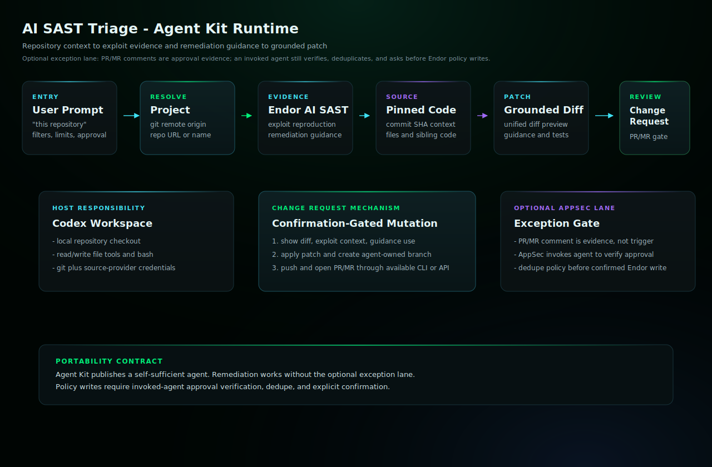

# AI SAST Triage Codex Skill

Parse Endor AI SAST findings, use exploit reproduction and remediation guidance as patch context, fetch source at the pinned commit, and open change requests when requested.

## Install

Copy this generated skill directory into your Codex skills directory:

```bash
mkdir -p "${CODEX_HOME:-$HOME/.codex}/skills"
cp -R /path/to/endor-labs-agent-kit/codex/ai-sast-triage \
  "${CODEX_HOME:-$HOME/.codex}/skills/ai-sast-triage"
```

Start a new Codex session after installing or replacing the skill.

## Requirements

- Codex with filesystem and terminal access to the target repository.
- Endor tenant access through authenticated `endorctl api` or documented Endor API credentials.
- Git and source-provider credentials for approved branch, PR/MR, review, or comment workflows.
- A configured AppSec approver list before standalone exception-policy creation.
- Endor policy-write access only after verified AppSec approval and explicit user confirmation.

## Example

```text
Use the ai-sast-triage skill to triage AI SAST findings for this repository. Do not edit files, open a PR/MR, or create an Endor policy unless I approve the specific gate.
```

## Example Workflow

```text
Use the ai-sast-triage skill to triage AI SAST findings for this repository. Do not edit files, open a PR/MR, or create an Endor policy. Show confirmed true positives, likely false positives, inconclusive findings, exploit-driven priority, remediation-guidance usage, and data gaps.
```

```text
Use the ai-sast-triage skill to remediate finding <finding_uuid> for this repository. Use Endor Exploit Reproduction and Remediation Guidance as context, but verify the fix against the source. Show me the patch, branch name, PR/MR title, and PR/MR body before pushing. After I approve, open exactly one PR/MR.
```

Use the exception workflow only when a finding should be excepted instead
of remediated in code.

```text
Use the ai-sast-triage skill to verify AppSec approval on PR/MR <pr_or_mr_url> for finding <finding_uuid>. Allowed AppSec approvers: @alice, @bob. If approval is valid and not self-approval, check for an existing active Endor exception policy for this finding/project/reason, then render the Endor exception policy spec for my confirmation. After I confirm, create or reuse the scoped policy and comment on the PR/MR with the policy name, policy UUID, Endor project, approver, expiration, and evidence URL.
```

## QA Smoke Test

Use a fresh Codex session after installing the skill. Run a planning-only
prompt first and verify the response references the Codex skill, preserves
approval gates, and does not claim file edits, PR/MR creation, comments, or
Endor policy writes.

## Architecture



In Agent Kit, PR/MR creation is host-mediated. Codex runs in the target checkout, gathers Endor evidence including exploit reproduction and remediation guidance when present, applies the confirmed diff locally, creates and pushes a branch, then opens the change request with configured source-provider credentials. If the host cannot perform one of those steps, the agent must stop and report the missing capability in `data_gaps`.

## Notes

- `SKILL.md` is generated from the source recipe and should not be hand-edited in installed copies.
- `actions.yaml` records semantic side-effect contracts when the recipe declares mutating actions.
- Keep host-specific approval gates intact: local edits, branch pushes, PR/MR creation, PR/MR comments, and Endor policy writes are separate decisions.
