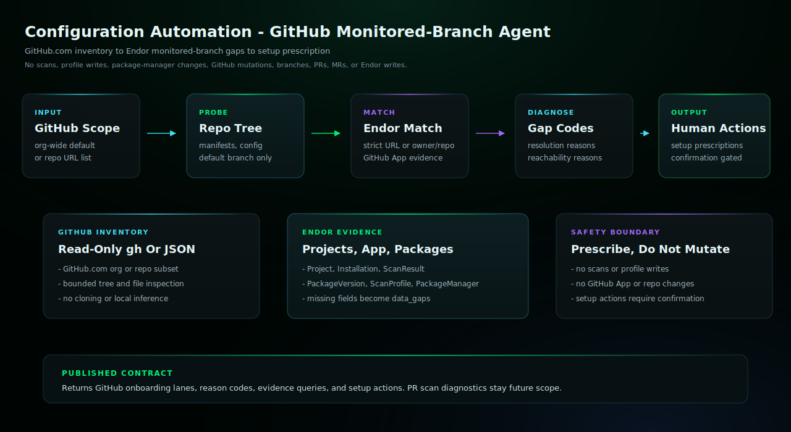

# Configuration Automation Codex Skill

Use this agent when the user wants to assess GitHub repository onboarding
gaps for Endor Labs monitored-branch coverage. Configuration Automation compares
github.com organization or repository inventory with Endor project, GitHub
App, package, scan, scan profile, package manager integration, dependency
resolution, and reachability evidence, then returns human-readable setup
actions without mutating source, GitHub, or Endor state.

## Start Here

This is the Codex generated skill for `configuration-automation`.

| Reader | First move |
| --- | --- |
| Human operator | Copy this generated skill directory into `$HOME/.agents/skills/` and start a new Codex session. Then use the example prompt below: Use the configuration-automation skill to probe GitHub org <org> for Endor monitored-branch onboarding gaps and setup prescriptions. Keep the workflow read-only. |
| Agent installer | Copy the generated files exactly, including the generated prompt or skill file, `endorctl-setup.md`, `architecture.svg`. Do not summarize or rewrite the generated prompt. |
| Maintainer | Change `source/agents/configuration-automation/recipe.yaml`, `instructions.md`, evals, action contracts, or `architecture.svg`, then regenerate the catalog. Do not hand-edit generated copies. |

## Recommended Model

This is a release-QA target, not a requirement or model allowlist.
Agent Kit does not block compatible customer-selected host models.

- Recommended model: `gpt-5.6-luna`.
- Selection mode: `pinned`.
- Recommended reasoning/effort: `medium`.
- Generated behavior: custom-agent TOML pins gpt-5.6-luna and tier-specific reasoning effort.
- Override behavior: explicit Codex model and reasoning settings win.
- Provider guidance: <https://developers.openai.com/codex/subagents>.

## Install

Copy this generated skill directory into your Codex skills directory:

```bash
mkdir -p "$HOME/.agents/skills"
cp -R /path/to/endor-labs-agent-kit/codex/configuration-automation \
  "$HOME/.agents/skills/configuration-automation"
```

Start a new Codex session after installing or replacing the skill.

## Requirements

- Codex with access to the current workspace.
- The Endor access path declared by the recipe.
- No mutating repository, source-provider, or Endor writes for this skill.

## Example

```text
Use the configuration-automation skill to probe GitHub org <org> for Endor monitored-branch onboarding gaps and setup prescriptions. Keep the workflow read-only.
```

## Example Workflow

```text
Use the configuration-automation skill to probe GitHub org <org> for Endor monitored-branch onboarding gaps and setup prescriptions. Keep the workflow read-only, do not run scans, do not clone repositories, and separate not-onboarded repositories from already-onboarded repositories with dependency resolution or reachability gaps.
```

```text
Use the configuration-automation skill to compare these GitHub repositories with Endor namespace <namespace>: <owner/repo>, <owner/repo>. Report the top setup actions for missing package manager integrations, scan profile/toolchain gaps, dependency resolution blockers, reachability blockers, and GitHub App selection gaps.
```

## QA Smoke Test

Use a fresh Codex session after installing the skill. Run a planning-only
prompt first and verify the response references the Codex skill, preserves
approval gates, and does not claim file edits, PR/MR creation, comments, or
Endor policy writes.

## Architecture



This read-only agent compares GitHub.com repository inventory with Endor project, GitHub App, monitored-branch scan, package, scan profile, toolchain, and package-manager evidence. It returns onboarding lanes, reason codes, evidence queries, and setup prescriptions, but does not run scans, create profiles, edit repositories, change GitHub settings, or mutate Endor state.

## Notes

- `SKILL.md` is generated from the source recipe and should not be hand-edited in installed copies.
- This read-only skill does not include `actions.yaml`; future mutating workflows must declare explicit action contracts before publication.
- Keep host-specific approval gates intact: local edits, branch pushes, PR/MR creation, PR/MR comments, and Endor policy writes are separate decisions.
