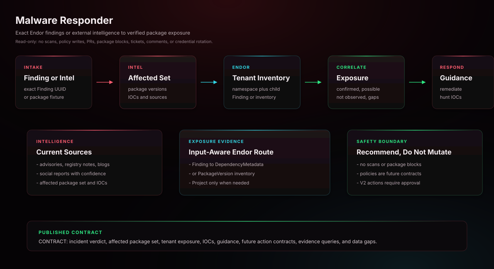

# Malware Responder Codex Skill

Correlates current software supply-chain malware intelligence for affected
packages and versions with Endor inventory across a namespace and its child
namespaces. It distinguishes confirmed exposure, possible exposure,
not-observed exposure, and insufficient data using exact package, version,
and inventory evidence. It reports affected projects, indicators of
compromise, containment guidance, and recommended follow-up actions without
modifying Endor or source systems.

## Start Here

This is the Codex generated skill for `malware-responder`.

| Reader | First move |
| --- | --- |
| Human operator | Copy this generated skill directory into `$HOME/.agents/skills/` and start a new Codex session. Then use the example prompt below: Use the malware-responder skill to help with this Endor Labs workflow. |
| Agent installer | Copy the generated files exactly, including the generated prompt or skill file, `endorctl-setup.md`, `architecture.svg`. Do not summarize or rewrite the generated prompt. |
| Maintainer | Change `source/agents/malware-responder/recipe.yaml`, `instructions.md`, evals, action contracts, or `architecture.svg`, then regenerate the catalog. Do not hand-edit generated copies. |

## Recommended Model

This is a release-QA target, not a requirement or model allowlist.
Agent Kit does not block compatible customer-selected host models.

- Recommended model: `gpt-5.6-luna`.
- Selection mode: `pinned`.
- Recommended reasoning/effort: `medium`.
- Generated behavior: custom-agent TOML pins gpt-5.6-luna and tier-specific reasoning effort.
- Override behavior: explicit Codex model and reasoning settings win.
- Provider guidance: <https://developers.openai.com/codex/subagents>.

## Install

Copy this generated skill directory into your Codex skills directory:

```bash
mkdir -p "$HOME/.agents/skills"
cp -R /path/to/endor-labs-agent-kit/codex/malware-responder \
  "$HOME/.agents/skills/malware-responder"
```

Start a new Codex session after installing or replacing the skill.

## Requirements

- Codex with access to the current workspace.
- The Endor access path declared by the recipe.
- No mutating repository, source-provider, or Endor writes for this skill.

## Example

```text
Use the malware-responder skill to help with this Endor Labs workflow.
```

## Architecture



This diagram shows the generated agent contract, host responsibilities, and external systems required at runtime.

## Notes

- `SKILL.md` is generated from the source recipe and should not be hand-edited in installed copies.
- This read-only skill does not include `actions.yaml`; future mutating workflows must declare explicit action contracts before publication.
- Keep host-specific approval gates intact: local edits, branch pushes, PR/MR creation, PR/MR comments, and Endor policy writes are separate decisions.
