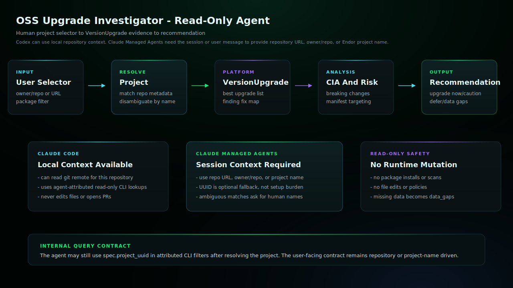

# OSS Upgrade Investigator Codex Skill

Use this agent to investigate safe OSS upgrade paths, upgrade risk, findings
fixed or introduced, Code Impact Analysis, breaking changes, manifest
targeting, or whether a dependency upgrade should happen now. It queries
Endor's read-only VersionUpgrade workflow through the agent-attributed CLI
transport.

## Start Here

This is the Codex generated skill for `oss-upgrade-investigator`.

| Reader | First move |
| --- | --- |
| Human operator | Copy this generated skill directory into `$HOME/.agents/skills/` and start a new Codex session. Then use the example prompt below: Use the oss-upgrade-investigator skill to help with this Endor Labs workflow. |
| Agent installer | Copy the generated files exactly, including the generated prompt or skill file, `endorctl-setup.md`, `architecture.svg`. Do not summarize or rewrite the generated prompt. |
| Maintainer | Change `source/agents/oss-upgrade-investigator/recipe.yaml`, `instructions.md`, evals, action contracts, or `architecture.svg`, then regenerate the catalog. Do not hand-edit generated copies. |

## Install

Copy this generated skill directory into your Codex skills directory:

```bash
mkdir -p "$HOME/.agents/skills"
cp -R /path/to/endor-labs-agent-kit/codex/oss-upgrade-investigator \
  "$HOME/.agents/skills/oss-upgrade-investigator"
```

Start a new Codex session after installing or replacing the skill.

## Requirements

- Codex with access to the current workspace.
- The Endor access path declared by the recipe.
- No mutating repository, source-provider, or Endor writes for this skill.

## Example

```text
Use the oss-upgrade-investigator skill to help with this Endor Labs workflow.
```

## Architecture



This read-only agent resolves a human project selector to the Endor project used for VersionUpgrade queries. Claude Managed Agents do not inspect local git by default, so sessions should provide a repository URL, owner/repo, or Endor project name instead of requiring a project UUID.

## Notes

- `SKILL.md` is generated from the source recipe and should not be hand-edited in installed copies.
- This read-only skill does not include `actions.yaml`; future mutating workflows must declare explicit action contracts before publication.
- Keep host-specific approval gates intact: local edits, branch pushes, PR/MR creation, PR/MR comments, and Endor policy writes are separate decisions.
