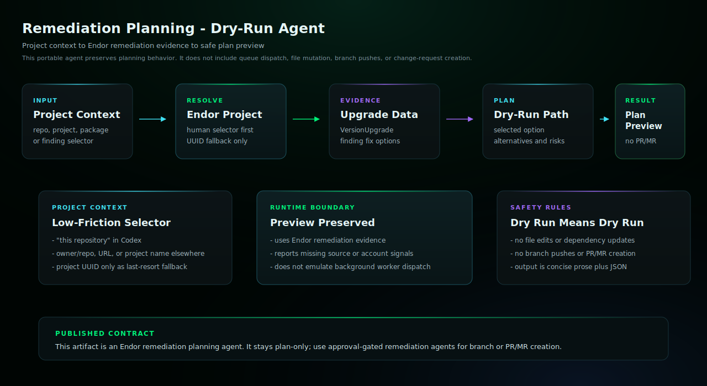

# Remediation Planning Codex Skill

Preview safe remediation options without opening PRs.

## Start Here

This is the Codex generated skill for `remediation-planning`.

| Reader | First move |
| --- | --- |
| Human operator | Copy this generated skill directory into `$HOME/.agents/skills/` and start a new Codex session. Then use the example prompt below: Use the remediation-planning skill to help with this Endor Labs workflow. |
| Agent installer | Copy the generated files exactly, including the generated prompt or skill file, `endorctl-setup.md`, `architecture.svg`. Do not summarize or rewrite the generated prompt. |
| Maintainer | Change `source/agents/remediation-planning/recipe.yaml`, `instructions.md`, evals, action contracts, or `architecture.svg`, then regenerate the catalog. Do not hand-edit generated copies. |

## Install

Copy this generated skill directory into your Codex skills directory:

```bash
mkdir -p "$HOME/.agents/skills"
cp -R /path/to/endor-labs-agent-kit/codex/remediation-planning \
  "$HOME/.agents/skills/remediation-planning"
```

Start a new Codex session after installing or replacing the skill.

## Requirements

- Codex with access to the current workspace.
- The Endor access path declared by the recipe.
- No mutating repository, source-provider, or Endor writes for this skill.

## Example

```text
Use the remediation-planning skill to help with this Endor Labs workflow.
```

## Architecture



This dry-run workflow resolves project or finding context, gathers Endor remediation evidence, and returns a plan only. It does not edit files, push branches, or open PRs/MRs.

## Notes

- `SKILL.md` is generated from the source recipe and should not be hand-edited in installed copies.
- This read-only skill does not include `actions.yaml`; future mutating workflows must declare explicit action contracts before publication.
- Keep host-specific approval gates intact: local edits, branch pushes, PR/MR creation, PR/MR comments, and Endor policy writes are separate decisions.
