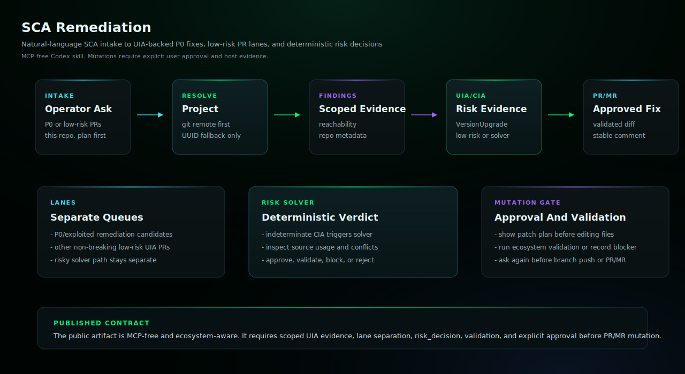

# SCA Remediation Codex Skill

Plan and remediate dependency vulnerabilities with Endor SCA findings, VersionUpgrade/UIA evidence, separate low-risk PR lanes, deterministic risk decisions, local validation, and approved PR/MR creation.

## Start Here

This is the Codex generated skill for `sca-remediation`.

| Reader | First move |
| --- | --- |
| Human operator | Copy this generated skill directory into `$HOME/.agents/skills/` and start a new Codex session. Then use the example prompt below: Use the sca-remediation skill to check this repository for P0 SCA findings I can start remediating. Do not edit files or open a PR/MR until I approve. |
| Agent installer | Copy the generated files exactly, including the generated prompt or skill file, `actions.yaml`, `endorctl-setup.md`, `architecture.svg`. Do not summarize or rewrite the generated prompt. |
| Maintainer | Change `source/agents/sca-remediation/recipe.yaml`, `instructions.md`, evals, action contracts, or `architecture.svg`, then regenerate the catalog. Do not hand-edit generated copies. |

## Install

Copy this generated skill directory into your Codex skills directory:

```bash
mkdir -p "$HOME/.agents/skills"
cp -R /path/to/endor-labs-agent-kit/codex/sca-remediation \
  "$HOME/.agents/skills/sca-remediation"
```

Start a new Codex session after installing or replacing the skill.

## Requirements

- Codex with filesystem and terminal access to the target repository.
- Endor tenant access through authenticated `endorctl api` or documented Endor API credentials.
- Git and source-provider credentials for approved branch, PR/MR, review, or comment workflows.

## Example

```text
Use the sca-remediation skill to check this repository for P0 SCA findings I can start remediating. Do not edit files or open a PR/MR until I approve.
```

## Example Workflow

```text
Use the sca-remediation skill to show me the other non-breaking low-risk UIA-backed PRs for this repository. Keep this separate from the P0/exploited queue and risky solver. Do not edit files, create branches, push, or open a PR/MR.
```

```text
Use the sca-remediation skill to prepare the top UIA-backed dependency remediation for this repository. Show the selected package, affected manifests, VersionUpgrade/UIA UUID, risk, CIA status, risk_decision, findings fixed, folded advisory/finding list, validation command, branch name, PR/MR title, and body before changing files.
```

## QA Smoke Test

Use a fresh Codex session after installing the skill. Run a planning-only
prompt first and verify the response references the Codex skill, preserves
approval gates, and does not claim file edits, PR/MR creation, comments, or
Endor policy writes.

## Architecture



This mutating Codex skill resolves repository context, queries Endor SCA findings, requires VersionUpgrade/UIA evidence before recommending a best first fix, keeps non-breaking low-risk UIA PR candidates separate from the P0/exploited queue and risky solver, resolves risky or CIA-indeterminate upgrades into a deterministic risk_decision, prepares local dependency changes, runs ecosystem-appropriate validation when possible, and opens a PR/MR only after explicit approval. It does not use or require an Endor MCP server.

## Notes

- `SKILL.md` is generated from the source recipe and should not be hand-edited in installed copies.
- `actions.yaml` records semantic side-effect contracts when the recipe declares mutating actions.
- Keep host-specific approval gates intact: local edits, branch pushes, PR/MR creation, PR/MR comments, and Endor policy writes are separate decisions.
