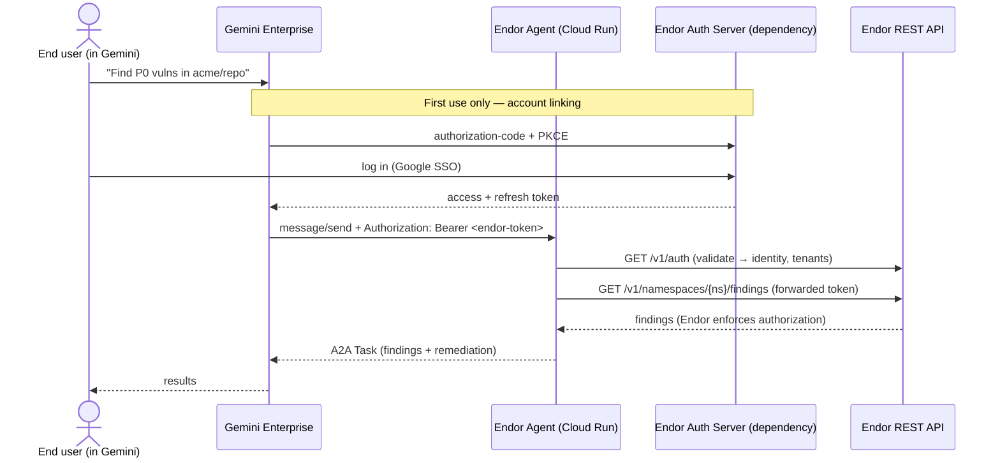

# Authentication & Multi-Tenancy Design — Gemini Enterprise SCA Agent

**Audience:** anyone picking up this service — Endor engineers, the identity
team, GCP reviewers. It explains how a request from Gemini Enterprise becomes an
authorized, tenant-scoped read of Endor findings, what is built today, and the
one external dependency that gates going live.

---

## 1. The problem in one paragraph

Our agent is a hosted [A2A](https://a2a-protocol.org/) service. When a user in
Gemini Enterprise asks it to analyze a repo, the agent must call the **Endor
REST API scoped to *that customer's* tenant** and return only data that user is
allowed to see. So two things must travel from Gemini to us and then to Endor:
**who the caller is** (identity → tenant) and **a credential Endor accepts**.

## 2. The two flows Google supports

Per the GCP architect, Gemini Enterprise Marketplace offers two auth flows:

- **Flow 1 — B2B subscription (procurement).** The billing admin subscribes.
  Gemini contacts our **DCR** endpoint (or we register a client manually with
  `client_id`/`secret`). At runtime we receive **(a)** an `Authorization: Bearer`
  — a Google-issued access token identifying the end user — and **(b)** a
  Google-signed JWT in `metadata.software_statement` asserting the call is from
  Gemini and carrying the **Marketplace Order ID** (`google.order`) and
  **Procurement Account ID** (`sub`). This flow is about **billing/entitlement
  and provenance** — *who paid*.

- **Flow 2 — end user connects to Endor.** On first use the user is asked to
  **Authorize**; they're sent to **Endor's authorization URL**, log in, and
  Gemini receives a token it then sends us as `Authorization: Bearer`. This flow
  is about **data access** — *who can read what*.

For a **read-only data agent, Flow 2 is the primary path**: the user's own Endor
login resolves both the tenant and their authorization. Flow 1 remains relevant
only to gate on a valid subscription.

## 3. Why Endor's login page is *not* enough for Flow 2

A common assumption is "Endor already has `app.endorlabs.com/login`, use that."
A login **page** is not an authorization **server**:

| A login page… | Flow 2 needs… |
| --- | --- |
| authenticates a **human** to Endor's own web app | a **third party (Gemini)** to obtain a delegated token to call the API *as* the user |
| returns a **browser session cookie** | an **`/authorize`** endpoint taking `client_id`, `redirect_uri`, `scope`, `response_type=code`, PKCE |
| knows nothing about third-party clients | **client registration** (`client_id`/`secret`) |
| — | a **consent screen** ("Gemini wants read access to your Endor findings") |
| — | a **`/token`** endpoint issuing an access + refresh token |

Evidence: Endor's public API exposes **no `/oauth/authorize` or `/token`** — only
api-key exchange (`POST /v1/auth/api-key`), SSO `authenticate`, and userinfo
(`GET /v1/auth`). So there is nothing today for Gemini to drive as an OAuth
client. Behind `/login` there *is* real identity machinery (Google SSO → Endor
mints a token — Endor identities encode the federation, e.g. `user@example.com@google@api-key`),
but it is wired for Endor's **own** frontend, not exposed as a **third-party**
OAuth authorization server.

**→ The one gate for Flow 2: Endor must expose an OAuth 2.0 authorization-code
server** (`/authorize`, `/token`, `/refresh`, client registration) whose tokens
the Endor API accepts. Possibly config if Endor's IdP is Auth0/Okta/Cognito
under the hood; real work if custom. This is the question for the **Endor
identity team**, not GCP.

## 4. Our design: resource server + token forwarding

We do **not** build our own OAuth authorization server. The agent is a
**resource server**: it receives a bearer token, validates it against Endor, and
**forwards it** to the Endor API. Endor enforces the user's own authorization on
every call — so the agent stores **no per-tenant credentials**, which is the
safest posture for vulnerability data.



The only thing the "Endor Auth Server" box gates is **how the token is minted**.
The agent code is identical whether the token came from an api-key exchange
(today, in tests/smoke) or from OAuth once that server exists — Endor even
reports which via the token's `authentication_source`.

### 4.1 Where it lives in the code

| Concern | Component |
| --- | --- |
| Capture the bearer from the request | `service/a2a/context.py` → `CallerContext.bearer_token` |
| Choose auth mode per request | `service/request_client.py` → `build_client_for_request()` |
| Forward the token to Endor | `service/endor_client/token_source.py` → `ForwardedBearer` |
| Validate token → identity/tenants | `service/endor_client/identity.py` → `EndorIdentityClient` |
| Query findings (unchanged) | `service/endor_client/rest.py` → `RestEndorSCAClient` |

**Auth modes** (`ENDOR_AUTH_MODE`):

- `service_credential` (default) — the process uses its own api-key and scopes
  by namespace. Used for local/dev and the current read-only PR.
- `forwarded` (**Flow 2**) — per request, the agent forwards the caller's bearer
  token; Endor enforces authorization. No stored credential.

The `CallerContext` seam means switching modes changes **one factory**, not the
request path. A third mode, `exchange`, covers the AgentHQ pattern below.

### 4.2 Precedent: Endor already ships this pattern (GitHub AgentHQ)

`endorlabs/monorepo#31669` (merged) added an **RFC 7523 token-exchange endpoint**
`POST /v1/auth/agenthq/token`: GitHub AgentHQ presents its **signed OIDC JWT**;
Endor verifies it against GitHub's JWKS (checking `iss`/`aud`) and mints a
short-lived **Endor access token**. It deliberately mirrors the older
`POST /v1/auth/github-action` flow — their rule is **new issuer → new endpoint**.
Key properties:

- Minted token is **namespace-unscoped**; the caller sets `tenant_meta.namespace`
  per request.
- **AuthZ via the existing `AuthorizationPolicy` mechanism** — an admin creates a
  policy in the target namespace whose clause names the external identity
  (`installation_id=…`, `repository_owner=…`).

For Gemini this is a one-to-one analogy — the Google OIDC token Gemini forwards
is the assertion, a new `POST /v1/auth/<gemini>/token` is the endpoint, and the
customer's Endor admin authorizes the Gemini identity with an
`AuthorizationPolicy`. This is **the preferred ask**: a well-trodden pattern
Endor has now implemented twice, not a net-new interactive OAuth server.

Our `ExchangedTokenSource` (in `token_source.py`) already implements the client
half of this contract (JWT-bearer grant, OAuth2 JSON response); it works
unchanged the moment the Gemini endpoint exists.

## 5. Multi-tenancy

Endor is **single-domain, path/namespace-based** multi-tenant:

- UI: `app.endorlabs.com/t/<namespace>/`
- API: `api.endorlabs.com/v1/namespaces/<namespace>/…`

There is **no unique URL/subdomain per customer**. Therefore:

- **One** Agent Card, **one** authorization URL — a single marketplace listing
  serves every customer.
- The **tenant is derived from the authenticated user's identity/namespace**,
  not from the URL.
- A user may belong to **multiple namespaces** (our probe returned
  several, e.g. `tenant-a, tenant-b, …`), so token→namespace resolution needs
  a default or a picker when the request doesn't name one.

## 6. What is built and testable **now**

Everything on the agent side of Flow 2, proven against the live Endor API using
an api-key-minted token as a stand-in:

- `GET /v1/auth` → identity + accessible tenants (the resolver).
- `GET /v1/namespaces/{ns}/auth` → authorization check within a namespace.
- Forward the token to `…/findings`; Endor returns only permitted data, and a
  bad token yields a clean auth error.

Run it:

```bash
cd gemini-enterprise
ENDOR_ALLOW_ENDORCTL_CONFIG=1 python scripts/flow2_smoke.py <owner/repo> [namespace]
```

Offline coverage (no network/secrets): `tests/test_flow2_forwarding.py`.

## 7. What is **blocked** (external dependencies)

1. **Endor OAuth authorization server** (identity team) — the `/authorize`,
   `/token`, `/refresh`, client-registration surface whose tokens the API
   accepts. Without it, Flow 2 cannot be driven from Gemini end-to-end.
2. **Which token Gemini sends** (GCP) — a Google OIDC token vs. a
   DCR-negotiated one; confirms whether we validate against Google's JWKS or
   Endor's.
3. **Read-only scopes + consent screen** — the scope string and the third-party
   consent UI Endor shows.

## 8. Open questions

**To the Endor identity team**
1. Can Endor expose an OAuth 2.0 authorization-code server a third party
   registers with (manual `client_id`/`secret` is acceptable to Google)?
2. Are its tokens accepted directly by `api.endorlabs.com/v1/…`, or is there an
   exchange step?
3. Token → namespace: is `GET /v1/auth` / `/v1/namespaces/{ns}/auth` the
   intended resolution, and how should multi-namespace users be handled?
4. Read-only scopes for SCA findings; refresh-token support and lifetime.
5. Is there a consent screen for third-party delegation?

**To GCP** (see also the standing auth question)
6. Does Flow 2's Authorize button target a single authorization URL (tenant from
   login), which fits our single-listing/path-based tenancy?
7. For Flow 1, is `software_statement` (`google.order`, `sub`) the intended
   entitlement signal to gate access on?

## 9. Recommendation

Prefer the **token-exchange** path (§4.2) over an interactive OAuth server:
ask the Endor identity team to add a **Gemini/Google token-exchange endpoint
modeled on `/v1/auth/agenthq/token`** (endorlabs/monorepo#31669) — a pattern
they've already shipped twice — with `AuthorizationPolicy`-based tenant authz.
That single endpoint unblocks the live path, and our `ExchangedTokenSource`
already implements the client side. Keep **Flow 1**'s `software_statement`
(`google.order`, `sub`) for entitlement gating. The full interactive
authorization-code server (Flow 2) is a heavier fallback only if token exchange
is not viable.
