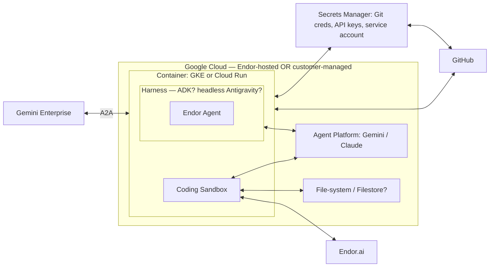

# Hosting options — Google CSE joint session (2026-09-14)

What the Google Cloud CSE sketched as hosting options for the Endor agent, plus
how it maps to what exists today and the questions it sharpens. This is a
**runtime/hosting** picture; it does not by itself resolve the *listing* question
(see `progress-and-hosting-readiness.md` and the feasibility analysis).

## The sketch

One container (GKE **or** Cloud Run) that can run **either** in Endor's project
("SaaS agents, hosted by Endor") **or** in the customer's project
("customer-managed"):

## The key signal: this is the *code-access* agent

The **Coding Sandbox + GitHub clone + Filestore + Endor.ai** wiring describes an
agent that **clones customer repos and runs analysis in a sandbox** — beyond
"public OSS Q&A" (Option A) and "read tenant findings" (Option B). It's the
**highest-value and heaviest** path, and it lands on the pieces prior analysis
flagged as **not existing today**: an isolated per-task **execution plane**
(the sandbox), SCM-credential handling, and per-task storage.

## Two framings, and how each lists

| Framing | Runtime | Listing path (per Google docs) |
| --- | --- | --- |
| **Hosted by Endor** | container in Endor's GCP | **partner-hosted A2A → the listable path** |
| **Customer-managed** | same container in the customer's GCP | GKE-app listing, or an **org-scoped custom agent** — **not** an "AI Agent as a Service" listing |

So the diagram is consistent with the feasibility finding: the runtime can be
built once and deployed either place, but **only the Endor-hosted framing is a
Marketplace agent listing** unless Google confirms another path.

## Map to what exists today

| Diagram box | State |
| --- | --- |
| A2A ↔ Gemini Enterprise | ✅ A2A app (`service/oss/app.py`) |
| Harness → Endor Agent | ✅ agent + tools + model loop (ADK shell) |
| Agent Platform (Gemini / Claude) | ✅ provider-pluggable (Gemini default, Claude switch) |
| Endor.ai | ✅ REST client (OSS today; findings client parked) |
| Coding Sandbox (execution plane) | ❌ not built |
| GitHub clone + Secrets Manager | ❌ not built |
| File-system / Filestore | ❌ not built |

We have the conversational agent + model + A2A + Endor API; the diagram adds the
code-execution half.

## The CSE's open questions — current read
- **Harness: ADK vs headless Antigravity?** ADK is the safer default — already
  wired, Google-native, managed sessions, clean Cloud Run / Agent Engine deploy.
  Consider headless Antigravity only if it buys code-execution ergonomics ADK
  lacks; confirm what Google would support.
- **Filestore for agents?** Only needed for the code-access path (repo checkouts
  / scratch). Option A needs none.

## Questions this sharpens for Google (pending)
1. For the **customer-managed** box, how does it become a **listing / co-sell** —
   GKE app, org-scoped custom agent, or a path we're missing? (Docs say
   customer-managed is not an "AI Agent as a Service" listing.)
2. For the **code-access** scope, does Google expect the **sandbox/execution
   plane** in the customer's project or Endor's, and what is their supported
   pattern for **SCM-credential handling**?
3. (Carried over) Does Gemini pass a Google identity we can exchange for
   tenant-scoped access, so per-user auth doesn't require Endor to run a full
   OAuth authorization server?

## Status
Recorded from the joint session. **On hold** pending GCP answers before any build
on the code-access / sandbox pieces.
