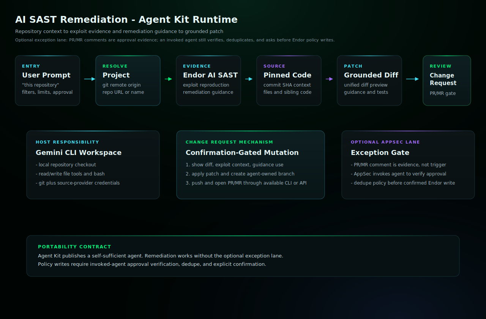

# AI SAST Remediation Gemini CLI Bundle

Parse Endor AI SAST findings, use exploit reproduction and remediation guidance as patch context, fetch source at the pinned commit, and open change requests when requested.

## Start Here

This is the Gemini CLI generated skill and subagent bundle for `ai-sast-remediation`.

| Reader | First move |
| --- | --- |
| Human operator | Prefer the generated Gemini extension under `plugins/gemini/endor-labs-agent-kit`, then restart Gemini CLI. Then use the example prompt below: Use @ai-sast-remediation to triage AI SAST findings for this repository. Do not edit files, open a PR/MR, or create an Endor policy unless I approve the specific gate. |
| Agent installer | Copy the generated files exactly, including the generated prompt or skill file, `actions.yaml`, `endorctl-setup.md`, `architecture.svg`. Do not summarize or rewrite the generated prompt. |
| Maintainer | Change `source/agents/ai-sast-remediation/recipe.yaml`, `instructions.md`, evals, action contracts, or `architecture.svg`, then regenerate the catalog. Do not hand-edit generated copies. |

## Recommended Model

This is a release-QA target, not a requirement or model allowlist.
Agent Kit does not block compatible customer-selected host models.

- Recommended model: `gemini-3.5-flash`.
- Selection mode: `pinned`.
- Recommended reasoning/effort: `host managed`.
- Generated behavior: subagent frontmatter pins model: gemini-3.5-flash.
- Override behavior: explicit subagent definition or host subagent configuration wins.
- Provider guidance: <https://geminicli.com/docs/core/subagents/>.

## Install Through The Generated Extension

Prefer the generated extension package under `plugins/gemini/endor-labs-agent-kit`.

```bash
gemini extensions install /path/to/endor-labs-agent-kit/plugins/gemini/endor-labs-agent-kit
```

Restart Gemini CLI after installing or updating the extension.

## Manual Fallback

Copy this bundle into a custom Gemini extension or install the skill and
subagent manually under your Gemini configuration.

## Requirements

- Gemini CLI with filesystem and terminal access to the target repository.
- Endor tenant access through authenticated `endorctl agent api --agent-id ai-sast-remediation`.
- Git and source-provider credentials for approved branch, PR/MR, review, or comment workflows.
- A configured AppSec approver list before standalone exception-policy creation.
- Endor policy-write access only after verified AppSec approval and explicit user confirmation.

## Example

```text
Use @ai-sast-remediation to triage AI SAST findings for this repository. Do not edit files, open a PR/MR, or create an Endor policy unless I approve the specific gate.
```

## Example Workflow

```text
Use @ai-sast-remediation to triage AI SAST findings for this repository. Do not edit files, open a PR/MR, or create an Endor policy. Show confirmed true positives, likely false positives, inconclusive findings, exploit-driven priority, remediation-guidance usage, and data gaps.
```

## Architecture



In Agent Kit, PR/MR creation is host-mediated. Gemini CLI runs in the target checkout, gathers Endor evidence including exploit reproduction and remediation guidance when present, applies the confirmed diff locally, creates and pushes a branch, then opens the change request with configured source-provider credentials. If the host cannot perform one of those steps, the agent must stop and report the missing capability in `data_gaps`.

## Notes

- `SKILL.md` and the subagent markdown are generated from the source recipe and should not be hand-edited in installed copies.
- The plugin package installs the skill under `skills/<agent>/` and the subagent under `agents/<agent>.md`.
- Keep host-specific approval gates intact: local edits, branch pushes, PR/MR creation, PR/MR comments, and Endor policy writes are separate decisions.
- `actions.yaml` records semantic side-effect contracts when the recipe declares mutating actions.
