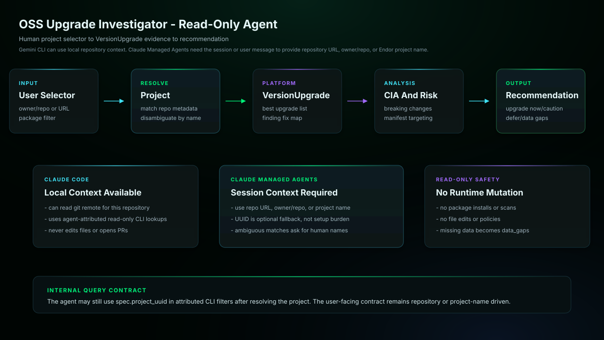

# OSS Upgrade Investigator Gemini CLI Bundle

Evaluates candidate dependency upgrades using Endor VersionUpgrade data,
Code Impact Analysis, findings, breaking-change information, and
Endor-provided manifest targets. It compares findings fixed or introduced
and explains the safest available upgrade path, including whether to upgrade
now, proceed cautiously, defer, or gather more evidence.

## Start Here

This is the Gemini CLI generated skill and subagent bundle for `oss-upgrade-investigator`.

| Reader | First move |
| --- | --- |
| Human operator | Prefer the generated Gemini extension under `plugins/gemini/endor-labs-agent-kit`, then restart Gemini CLI. Then use the example prompt below: Use @oss-upgrade-investigator to help with this Endor Labs workflow. |
| Agent installer | Copy the generated files exactly, including the generated prompt or skill file, `endorctl-setup.md`, `architecture.svg`. Do not summarize or rewrite the generated prompt. |
| Maintainer | Change `source/agents/oss-upgrade-investigator/recipe.yaml`, `instructions.md`, evals, action contracts, or `architecture.svg`, then regenerate the catalog. Do not hand-edit generated copies. |

## Recommended Model

This is a release-QA target, not a requirement or model allowlist.
Agent Kit does not block compatible customer-selected host models.

- Recommended model: `gemini-3.5-flash`.
- Selection mode: `pinned`.
- Recommended reasoning/effort: `host managed`.
- Generated behavior: subagent frontmatter pins model: gemini-3.5-flash.
- Override behavior: explicit subagent definition or host subagent configuration wins.
- Provider guidance: <https://geminicli.com/docs/core/subagents/>.

## Install Through The Generated Extension

Prefer the generated extension package under `plugins/gemini/endor-labs-agent-kit`.

```bash
gemini extensions install /path/to/endor-labs-agent-kit/plugins/gemini/endor-labs-agent-kit
```

Restart Gemini CLI after installing or updating the extension.

## Manual Fallback

Copy this bundle into a custom Gemini extension or install the skill and
subagent manually under your Gemini configuration.

## Requirements

- Gemini CLI with access to the current workspace.
- The Endor access path declared by the recipe.
- No mutating repository, source-provider, or Endor writes for this workflow.

## Example

```text
Use @oss-upgrade-investigator to help with this Endor Labs workflow.
```

## Architecture



This read-only agent resolves a human project selector to the Endor project used for VersionUpgrade queries. Claude Managed Agents do not inspect local git by default, so sessions should provide a repository URL, owner/repo, or Endor project name instead of requiring a project UUID.

## Notes

- `SKILL.md` and the subagent markdown are generated from the source recipe and should not be hand-edited in installed copies.
- The plugin package installs the skill under `skills/<agent>/` and the subagent under `agents/<agent>.md`.
- Keep host-specific approval gates intact: local edits, branch pushes, PR/MR creation, PR/MR comments, and Endor policy writes are separate decisions.
- This read-only workflow must report unavailable signals in `data_gaps`.
