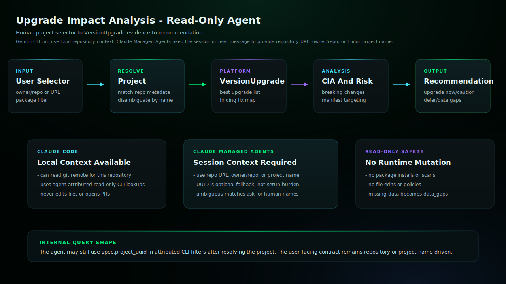

# Endor Labs Upgrade Impact Analysis Gemini CLI Bundle

Use this agent when the user asks for Endor Labs Upgrade Impact Analysis:
safe upgrade paths, upgrade risk, findings fixed or introduced, Code Impact
Analysis, breaking changes, manifest targeting, or whether a dependency
upgrade should happen now. The artifact queries Endor's read-only
VersionUpgrade workflow through the agent-attributed read-only CLI transport.

## Start Here

This is the Gemini CLI generated skill and subagent bundle for `upgrade-impact-analysis`.

| Reader | First move |
| --- | --- |
| Human operator | Prefer the generated Gemini extension under `plugins/gemini/endor-labs-agent-kit`, then restart Gemini CLI. Then use the example prompt below: Use @upgrade-impact-analysis to help with this Endor Labs workflow. |
| Agent installer | Copy the generated files exactly, including the generated prompt or skill file, `endorctl-setup.md`, `architecture.svg`. Do not summarize or rewrite the generated prompt. |
| Maintainer | Change `source/agents/upgrade-impact-analysis/recipe.yaml`, `instructions.md`, evals, action contracts, or `architecture.svg`, then regenerate the catalog. Do not hand-edit generated copies. |

## Install Through The Generated Extension

Prefer the generated extension package under `plugins/gemini/endor-labs-agent-kit`.

```bash
gemini extensions install /path/to/endor-labs-agent-kit/plugins/gemini/endor-labs-agent-kit
```

Restart Gemini CLI after installing or updating the extension.

## Manual Fallback

Copy this bundle into a custom Gemini extension or install the skill and
subagent manually under your Gemini configuration.

## Requirements

- Gemini CLI with access to the current workspace.
- The Endor access path declared by the recipe.
- No mutating repository, source-provider, or Endor writes for this workflow.

## Example

```text
Use @upgrade-impact-analysis to help with this Endor Labs workflow.
```

## Architecture



This read-only agent resolves a human project selector to the Endor project used for VersionUpgrade queries. Claude Managed Agents do not inspect local git by default, so sessions should provide a repository URL, owner/repo, or Endor project name instead of requiring a project UUID.

## Notes

- `SKILL.md` and the subagent markdown are generated from the source recipe and should not be hand-edited in installed copies.
- The plugin package installs the skill under `skills/<agent>/` and the subagent under `agents/<agent>.md`.
- Keep host-specific approval gates intact: local edits, branch pushes, PR/MR creation, PR/MR comments, and Endor policy writes are separate decisions.
- This read-only workflow must report unavailable signals in `data_gaps`.
